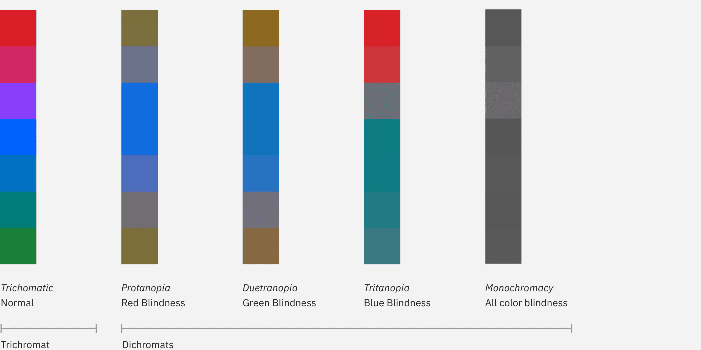
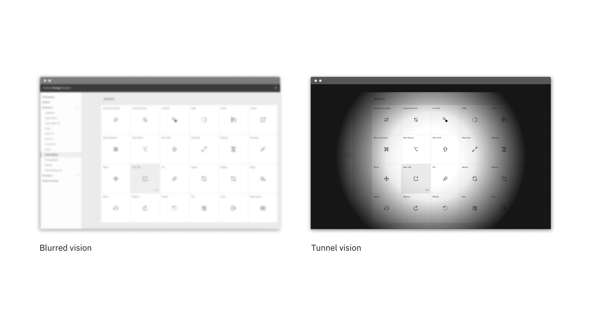

Farbe
=====

Einführung
----------

Die Komponenten des Cusy-Design-System wurden entwickelt, um das gesamte
Spektrum von Sehbehinderungen zu berücksichtigen. Die Entwickler*innen müssen
jedoch noch Sorgfalt walten lassen, um sicherzustellen, dass die Komponenten
auch korrekt verwendet werden.

Farbkontrast
------------

Das Cusy-Design-System erfüllt die `WCAG AA-Standards
<https://www.w3.org/TR/UNDERSTANDING-WCAG20/visual-audio-contrast-contrast.html>`_
für die beiden Standard-Themes des Systems, einschließlich der
Farbkontrastverhältnisse.

Standardtext
~~~~~~~~~~~~

Standardtext und Textbilder müssen ein Kontrastverhältnis von mindestens 4,5:1
haben.

Großer Text
~~~~~~~~~~~

Großer Text (mindestens 24px normal und hell oder 19px halbfett) muss ein
Kontrastverhältnis von 3:1 haben.

Text vor nicht statischem-Hintergrund
~~~~~~~~~~~~~~~~~~~~~~~~~~~~~~~~~~~~~

Wenn Text auf einem Verlaufshintergrund oder Bild gerendert wird, muss
sichergestellt werden, dass die Textfarbe an allen Stellen, an denen sie
angezeigt wird, den Kontraststandards entspricht. Dies ist besonders
wichtig für Parallax-Anwendungen oder Animationen, bei denen sich Text und
Hintergrund unabhängig voneinander bewegen.

UI-Komponenten
~~~~~~~~~~~~~~

Visuelle Informationen, die zum Anzeigen von Zuständen und Grenzen von
UI-Komponenten verwendet werden, müssen ein Kontrastverhältnis von 3:1 zu
benachbarten Farben aufweisen. Dies schließt auch Formularelemente ein.

.. seealso::
   * `IBM Checkpoint 1.4.3 Contrast (Minimum)
     <https://www.ibm.com/able/guidelines/ci162/contrast.html>`_

Farbenblindheit
---------------

Farbenblindheit beinhaltet Schwierigkeiten beim Wahrnehmen oder Unterscheiden
zwischen Farben sowie die Empfindlichkeit gegenüber Farbhelligkeit. Es betrifft
ungefähr einen von zwölf Männern und eine von zweihundert Frauen weltweit.

+---------------------+------------------------------------------------------+
| Art                 | Farbenblindheit                                      |
+=====================+======================================================+
| Protanopie          | Rot-Grün                                             |
+---------------------+------------------------------------------------------+
| Tritanopie          | Blau                                                 |
+---------------------+------------------------------------------------------+
| Deuteranopie        | Grün                                                 |
+---------------------+------------------------------------------------------+
| Monochromie         | Alle Farben                                          |
+---------------------+------------------------------------------------------+

Entwerfen für Farbenblindheit
~~~~~~~~~~~~~~~~~~~~~~~~~~~~~

Verlasst euch nicht nur auf Farbe, um Bedeutung zu vermitteln. Bedeutung ist
sowohl das Übermitteln von Informationen, das Anzeigen von Aktionen, das
Auffordern der Benutzer*innen zur Beantwortung oder das Unterscheiden eines
visuellen Elements von einem anderen. Beim Entwerfen mit Farbe kann es hilfreich
sein, einen Simulator für Farbenblindheit zu verwenden, um die Sichtbarkeit von
Inhalten zu überprüfen, wie z.B. das `Stark <http://www.getstark.co/>`_-Plugin
für Sketch.

Sehschwäche
-----------

Sehschwächen können  teilweises Sehen eines oder beider Augen umfassen und von
leicht bis schwer reichen. Sie betreffen etwa 4% der Weltbevölkerung.

+---------------------+------------------------------------------------------+
| Art                 | Sehschwäche                                          |
+=====================+======================================================+
| Geringe Schärfe     |  Auch als *verschwommenes Sehen* bekannt. Kann das   |
|                     |  Lesen von Text erschweren, da er unscharf erscheint.|
+---------------------+------------------------------------------------------+
| Kontrastarme        |  Verminderte Fähigkeit, feine Details zu bestimmen   |
| Empfindlichkeit     |  und ein Objekt von einem anderen Rzu unterscheiden  |
+---------------------+------------------------------------------------------+
| Eingeschränktes     |  Die Sicht des Benutzers ist teilweise behindert.    |
| Sichtfeld           |  Kann zentrales Sehen und fleckiges Sehen umfassen.  |
+---------------------+------------------------------------------------------+
| Retinitis           |  Auch als *Tunnelblick* bekannt. Der Benutzer kann   |
| pigmentosa          |  nur zentrale Elemente sehen.                        |
+---------------------+------------------------------------------------------+

Entwerfen für Sehschwäche
~~~~~~~~~~~~~~~~~~~~~~~~~

Um ein Verständnis für die verschiedenen Sehschwächen zu erhalten, empfehlen wir
die Verwendung des Chrome-Plugins `NoCoffee
<https://chrome.google.com/webstore/detail/nocoffee/jjeeggmbnhckmgdhmgdckeigabjfbddl>`_
zur Vorschau von Websites. Benutzer*innen mit Sehschwächen verwenden
möglicherweise einen Screen-Reader, um eine Vorschau der Website anzuzeigen.
Daher sollten unbedingt die :doc:`Tastaturrichtlinien <keyboard>` befolgt
werden, um sicherzustellen, dass die Seite den Benutzer*innen in einer logischen
Reihenfolge vorgelesen wird.

