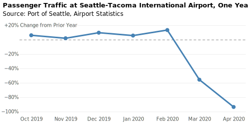

Datenvisualisierung
===================

* ❌ Verlasst euch nicht auf Farben um die Daten zu erklären
* ❌ Verwendet keine kontrastarmen Farben
* ❌ Versteckt keine wichtigen Daten hinter Interaktionen
* ❌ Überfordert euer Publikum nicht mit zu vielen Informationen
* ❌ Verlasst euch nicht auf ``hover``-Effekte; diese funktionieren nicht auf
  Mobilgeräten
* ❌ Verzichtet auf Animationen und Scroll-Hijacking, wenn diese nicht
  wesentlich zur Erklärung der Daten beitragen
* ✅ Beachtet bereits beim Design die Zugänglichkeit
* ✅ Beachtet auch kleinere Displays, :abbr:`z.B. (zum Beispiel)` bei
  Mobilgeräten
* ✅ Verwendet kontrastreiche Farben und Muster
* ✅ Verwendet Etiketten und Legenden
* ✅ Übersetzt die Daten in eine klare Sprache
* ✅ Gebt Kontext an und erklärt die Visualisierung

D3.js
-----

`D3.js <https://d3js.org/>`_ ist eine Javascript-Bibliothek zur
Datenvisualisierung. Um Datenvisualisierungen zugänglicher zu machen, haben wir
ein paar Tipps zusammengestellt:

#. Um die Farben zu erläutern, könnt ihr eine Legende hinzufügen, :abbr:`z.B.
   (zum Beispiel)` mit:

   .. code-block:: javascript

    const legend = chart.append("g").attr("aria-label", "Legend");

   Alternativ kann auch ein Titel hinzugefügt werden:

   .. code-block:: javascript

    const legend = chart.append("g");
    legend.append("text")
        .text("Legend")
        .attr("class", "legendTitle");

#. Nun können wir die Erläuterungen hinzufügen,  :abbr:`z.B.
   (zum Beispiel)`:

   .. code-block:: javascript

    legend.append("rect")
      .attr("fill", function(d){return hot(d) });

    legend.append("text")
       .text(">30 °C");

#. Erläutern der Daten, :abbr:`z.B. (zum Beispiel)` für ein Balkendiagramm:

   .. code-block:: javascript

    chart.selectAll(".label")
      .data(data)
      .enter().append("text")
      .text(row => row.year);

#. Optisch sind die Daten jetzt schon sehr viel zugänglicher, aber mit
   Bedienhilfen werden nun auch die Tage auf der x-Achse erschlossen,
   und würden :abbr:`z.B. (zum Beispiel)` alle vorgelesen werden. Die
   Zugänglichkeit würde deutlich erhöht werden, wenn die Ausgabe so etwas
   liefern würde wie *Die durchschnittliche Jahrestemperatur betrug 2011 9,6
   Grad Celsius*.

   Hierfür sollten dann nicht zunächst die Daten durchlaufen werden und
   anschließend die Achsenbeschriftungen sondern jedes Datum mit der zugehörigen
   Erläuterung:

   .. code-block:: javascript

    const ticks = chart.selectAll(".tick")
      .data(data)
      .enter().append("g")
      .attr("class", "tick");

    ticks.append("text")
      .text((data) => data.year);

    ticks.append("text")
      .text(row => row.temperature)
      .attr("class", "label");

   Dies gibt folgendes XML aus:

   .. code-block:: xml

    <g>
      <text>2011</text>
      <text>9,6 °C</text>
    </g>
    …

#. Bei vielen Achswerten soll :abbr:`evtl. (eventuell)` nicht jeder Wert auf
   der Achse angezeigt werden. ``display: none;`` oder ``visibility: hidden``
   sind jedoch keine Lösung, da die Werte dann :abbr:`z.B. (zum Beispiel)` auch
   nicht vorgelesen würden. Wir können jedoch die Positionierung der
   Achsenbeschriftungen so verändern, dass sie außerhalb des sichtbaren Rahmens
   stehen.

Vega
----

`Vega <https://pyviz-tutorial.readthedocs.io/de/latest/vega/index.html>`_ ist
eine deklarative Sprache zum Erstellen, Speichern und Teilen interaktiver
Visualisierungsdesigns. Ab Version 5.11 unterstützt sie einige ARIA-Attribute
für die Ausgabe von SVG-Dateien:

``aria``
    schließt ARIA-Attribute in SVG-Dateien ein. Der Standardwert ist ``true``.
    Bei ``false`` wird das ``aria-hidden``-Attribut für die entsprechende
    SVG-Gruppe gesetzt.
``description``
    liefert in ``aria-label`` eine Textbeschreibung des SVG-ELements, wenn
    ``aria`` den Wert ``true`` hat.

.. seealso::
   * `Vega Marks: Accessibility Properties
     <https://vega.github.io/vega/docs/marks/#accessibility-properties-511>`_

Mit `Flight Passengers Example
<https://vega.github.io/vega/examples/flight-passengers/>`_ gibt es ein Beispiel
für die Verwendung der Vega-Anweisungen ``aria``- und ``description`` durch
`Vega-Lite <https://github.com/vega/vega-lite>`_:

* Die horizontalen Linien sollen nicht zugänglich werden. Daher wurde in der
  Vega-Konfigurationsdatei :download:`flight-passengers.vg.json` die
  horizontale Linie mit ``"aria": false,`` nusgezeichnet.

  .. literalinclude:: flight-passengers.vg.json
     :language: javascript
     :lines: 108-122
     :lineno-start: 108
     :emphasize-lines: 4

  In der generierten SVG-Datei :download:`flight-passengers.svg`
  erhält die zugehörige Gruppe dadurch die Annotation ``aria-hidden="true"``:

  .. literalinclude:: flight-passengers.svg
     :language: xml
     :lines: 69-71
     :lineno-start: 69
     :emphasize-lines: 1

* Die Markierungen in der Zeitachse erhalten hingegen eine ausführliche
  Beschreibung (Englisch ``description``) mit Monat, Jahr und prozentualer
  Veränderung zum Vorjahr:

  .. literalinclude:: flight-passengers.vg.json
     :language: javascript
     :lines: 123-140
     :lineno-start: 123
     :emphasize-lines: 6-8

  In der generierten SVG-Datei erhalten die Pfade dadurch ein entsprechendes
  ``aria-label``:

  .. literalinclude:: flight-passengers.svg
     :language: xml
     :lines: 72-80
     :lineno-start: 72
     :emphasize-lines: 2-8

Zum Weiterlesen
---------------

.. seealso::
   * `Accessibility Considerations In Data Visualization Design 
     <https://keen.io/blog/accessibility-in-data-vis/>`_
   * `Dataviz Accessibility Resources
     <https://github.com/dataviza11y/resources>`_
   * `Accessibility in d3 Bar Charts
     <https://www.a11ywithlindsey.com/blog/accessibility-d3-bar-charts>`_
   * `Accessibility in d3 Donut Charts
     <https://www.a11ywithlindsey.com/blog/accessibility-d3-donut-charts>`_
   * `Writing Alt Text for Data Visualization
     <https://medium.com/nightingale/writing-alt-text-for-data-visualization-2a218ef43f81>`_
   * `Accessible SVGs
     <https://css-tricks.com/accessible-svgs/>`_
   * `WAI tutorials: Complex Images
     <https://www.w3.org/WAI/tutorials/images/complex/>`_
   * `Using VoiceOver to Evaluate Web Accessibility
     <https://webaim.org/articles/voiceover/>`_
   * `How Does This Data Sound? keyboard interaction, sonification etc.
     <https://blog.interactivethings.com/how-does-this-data-sound-945ed27a1a95>`_
