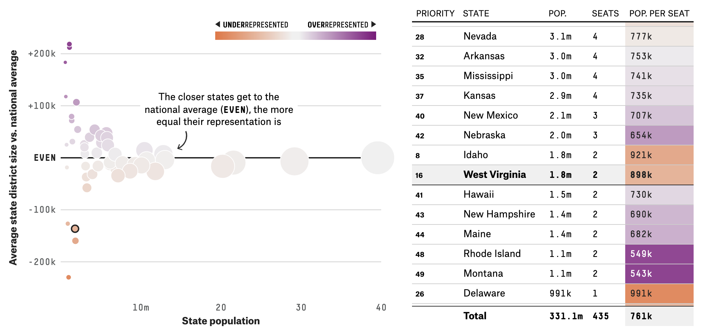
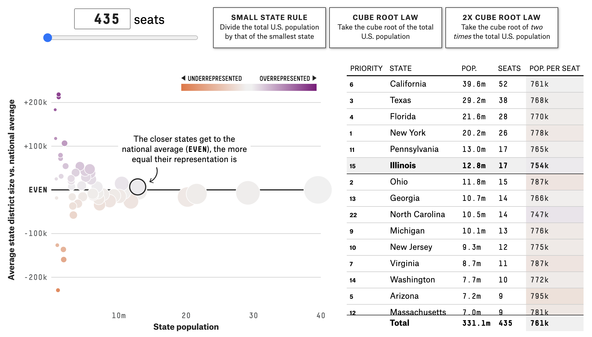

Operable
========

Dieses Prinzip bezieht sich hauptsächlich auf die interaktive
Datenvisualisierung. Dabei sollte jede Interaktion, die mit der Maus möglich
ist, sollte auch mit der Tastatur möglich sein. Hierbei sollte Der Tastaturfokus
deutlich sichtbar sein. Auch sollten die Interaktiven Elemente so groß sein,
dass sie leicht mit der Maus oder durch Berührung bedient werden können. Wenn
dies aufgrund der Beschaffenheit der Daten und des Diagrammtyps nicht möglich
ist, sollte eine Alternative, :abbr:`z.B. (zum Beispiel)` eine Tabelle,
präsentiert werden.

         Tabelle, die die Daten auf der rechten Seite zeigt.

Die interaktiven Funktionen sollten als solche erkennbar sein, und die
Interaktivität sollte dem Nutzer erklärt werden:

         zusätzlichen Zahlenschieberegler und drei Schaltflächen, die ein
         mögliches Szenario erklären.
