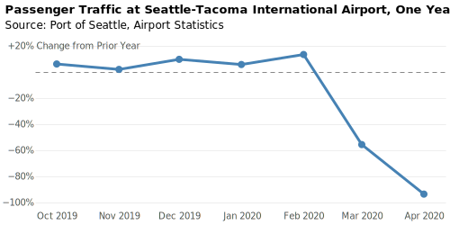

Vega
====

`Vega <https://pyviz-tutorial.readthedocs.io/de/latest/vega/index.html>`_ ist
eine deklarative Sprache zum Erstellen, Speichern und Teilen interaktiver
Visualisierungsdesigns. Ab Version 5.11 unterstützt sie einige ARIA-Attribute
für die Ausgabe von SVG-Dateien:

``aria``
    schließt ARIA-Attribute in SVG-Dateien ein. Der Standardwert ist ``true``.
    Bei ``false`` wird das ``aria-hidden``-Attribut für die entsprechende
    SVG-Gruppe gesetzt.
``description``
    liefert in ``aria-label`` eine Textbeschreibung des SVG-ELements, wenn
    ``aria`` den Wert ``true`` hat.

.. seealso::
   * `Vega Marks: Accessibility Properties
     <https://vega.github.io/vega/docs/marks/#accessibility-properties-511>`_

Mit `Flight Passengers Example
<https://vega.github.io/vega/examples/flight-passengers/>`_ gibt es ein Beispiel
für die Verwendung der Vega-Anweisungen ``aria``- und ``description`` durch
`Vega-Lite <https://github.com/vega/vega-lite>`_:

* Die horizontalen Linien sollen nicht zugänglich werden. Daher wurde in der
  Vega-Konfigurationsdatei :download:`flight-passengers.vg.json` die
  horizontale Linie mit ``"aria": false,`` ausgezeichnet.

  .. literalinclude:: flight-passengers.vg.json
     :language: javascript
     :lines: 108-122
     :lineno-start: 108
     :emphasize-lines: 4

  In der generierten SVG-Datei :download:`flight-passengers.svg`
  erhält die zugehörige Gruppe dadurch die Annotation ``aria-hidden="true"``:

  .. literalinclude:: flight-passengers.svg
     :language: xml
     :lines: 69-71
     :lineno-start: 69
     :emphasize-lines: 1

* Die Markierungen in der Zeitachse erhalten hingegen eine ausführliche
  Beschreibung (Englisch ``description``) mit Monat, Jahr und prozentualer
  Veränderung zum Vorjahr:

  .. literalinclude:: flight-passengers.vg.json
     :language: javascript
     :lines: 123-140
     :lineno-start: 123
     :emphasize-lines: 6-8

  In der generierten SVG-Datei erhalten die Pfade dadurch ein entsprechendes
  ``aria-label``:

  .. literalinclude:: flight-passengers.svg
     :language: xml
     :lines: 72-80
     :lineno-start: 72
     :emphasize-lines: 2-8
