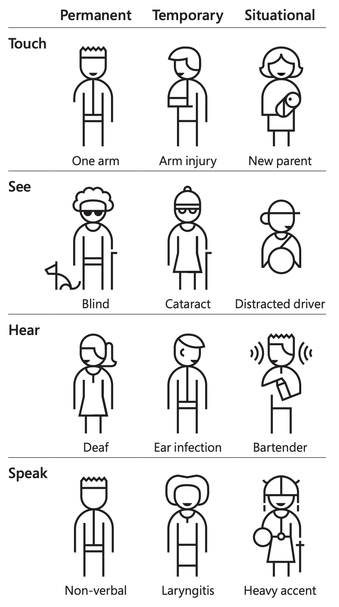

Überblick
=========

Zugänglichkeit
--------------

Barrierefreies Design hilft nicht nur Personen mit Einschränkungen, es
bietet auch  bessere Erfahrungen für alle. Alle cusy Design-Komponenten
berücksichtigen die `Web Content Accessibility Guidelines (WCAG) 2.0
<https://www.w3.org/Translations/WCAG20-de/>`_, `Section 508
<https://www.section508.gov/>`_ und europäischen Standards. Die Muster des
cusy Design-System sind für Personen wahrnehmbar, bedienbar und verständlich,
selbst wenn ein Screen-Reader oder andere unterstützende Technologien verwendet
werden.

Die Verwendung des cusy Design System wirkt sich jedoch auch auf die
Zugänglichkeit eines Produkts aus. Lest diese Seite, um mehr über
Barrierefreiheit im Allgemeinen zu erfahren. Verwendet dann während der Arbeit
die rollenspezifischen Richtlinien zur Barrierefreiheit des cusy Design-System,
um Produkte herzustellen, die jede*r verwenden kann.

Damit ein Produkt als zugänglich angesehen werden kann, sollte es

* für alle Personen die gleichen Vorteile erhalten, unabhängig von ihren
  Fähigkeiten
* von allem Personen dem jeweiligen Kontext angepasst werden können.

Kategorien von Zugänglichkeit
-----------------------------

Ein modernerer Blick auf die Zugänglichkeit geht über den Aspekt der
Beeinträchtigungen hinaus und berücksichtigt den gesamten Kontext, in dem
Menschen mit der Welt um sie herum interagieren:

* ihre kognitiven Fähigkeiten
* vorübergehende Beeinträchtigungen
* Merkmale der Umgebung

.. table:: Typen von Einschränkungen

    +--------------------------+-----------------------------------------------------+
    | Art                      | Beschreibung                                        |
    +==========================+=====================================================+
    | situationsbedingt        |  Eine Person mit typischer Sehstärke kann           |
    |                          |  :abbr:`z.B. (zum Beispiel)` Schwierigkeiten mit    |
    |                          |  einem Bildschirm in heller Umgebung haben. Oder    |
    |                          |  eine andere Person kann in einer Bibliothek ein    |
    |                          |  Video nur mit ausgeschaltetem Ton ansehen.         |
    +--------------------------+-----------------------------------------------------+
    | temporär                 | Eine Person mit gebrochenem Handgelenk kann         |
    |                          | möglicherweise nicht tippen, erlangt jedoch die     |
    |                          | Fähigkeit nach der Heilung zurück.                  |
    +--------------------------+-----------------------------------------------------+
    | andauernd                | Meist wird nur diese Art als »Behinderung«          |
    |                          | verstanden.                                         |
    +--------------------------+-----------------------------------------------------+

Microsofts `Inclusive Design <https://inclusive.microsoft.design>`_ umfasst
diesen breiteren Ansatz:

Blinde
~~~~~~

* Können Screen-Reader verwendet werden?
* Können Braille-Reader verwendet werden?
* Kann die Website oder die Software ohne Mauszeiger verwendet werden?
* Werden visuelle Informationen effektiv in Text übersetzt? Können Bilder und
  Plots nur durch die Metadaten verstanden werden?
* Lässt sich die Website oder die Software auch nur akustisch erfahren?

Sehbehinderte
~~~~~~~~~~~~~

Sehbehinderung kann ein teilweises Sehen mit einem oder beiden Augen umfassen
und von leicht bis schwer reichen. Sie betrifft ungefähr 4% der Weltbevölkerung.

* Können sie Bildschirmleser, Bildschirmlupen, kontrastreiche Modi und/oder
  monochrome Anzeigen verwenden?
* Lässt sich die Website erfahren, wenn der Browser auf eine größere Schrift
  eingestellt ist?
* Ist eine `Keyboard-Only Navigation
  <https://www.nngroup.com/articles/keyboard-accessibility/>`_ möglich?
* Wird `NoCoffee <https://github.com/eeejay/NoCoffee>`_ o.ä. verwendet um ein
  besseres Verständnis der verschiedenen Sehbehinderungen zu erhalten?

Farbenblinde
~~~~~~~~~~~~

Farbenblindheit betrifft 8% aller Männer und 0,4% der Frauen.

* Werden die Kontraste der Website oder der Software in Hinblick auf
  Farbenblindheit überprüft, :abbr:`z.B. (zum Beispiel)` mit dem
  Sketch-Plugin `Stark <https://www.getstark.co/>`_?

Gehörlose und Schwerhörige
~~~~~~~~~~~~~~~~~~~~~~~~~~

* Gibt es Untertitel und alternative Darstellungen von Audio? Beachtet dabei,
  dass alle davon profitieren können, :abbr:`z.B. (zum Beispiel)` in einer sehr
  lauten Umgebung.
* Werden Videos und Animationen transkribiert?

Körperliche Einschränkungen
~~~~~~~~~~~~~~~~~~~~~~~~~~~

* Sind alle Aktionen über die Tastatur zugänglich und effizient? Viele
  Personen bevorzugen die Navigation mit einer Tastatur vor der mit einer
  Maus, da dies die Produktivität erhöhen kann.

Kognitive Einschränkungen
~~~~~~~~~~~~~~~~~~~~~~~~~

* Bleiben Informationen sichtbar, die zu einem späteren Zeitpunkt benötigt
  werden?
* Sind schnell sich ändernde visuelle Reize nur optional? Werden Personen mit
  Epilepsie :abbr:`ggf. (gegebenenfalls)` davor gewarnt?
* Werden Heuristiken für kognitive Belastung im Design berücksichtigt?

Globale Barrierestandards
-------------------------

Die `Web Accessibility Initiative (WAI) <https://www.w3.org/WAI/>`_ des `World
Wide Web Consortium (W3C) <https://www.w3.org/WAI/>`_ ist ein Versuch, die
Zugänglichkeit des World Wide Web für Menschen aller Fähigkeiten zu verbessern.
Mitwirkende der WAI erstellen und pflegen `Richtlinien zur Barrierefreiheit von
Webinhalten (WCAG) <https://www.w3.org/TR/WCAG21/>`_, dem globalen Standard für
Barrierefreiheit. Version 2.0 wurde 2008 veröffentlicht und enthielt vier
Zugänglichkeitsgrundsätze, die auch als *POUR*-Prinzipien bezeichnet werden.

* :doc:`dataviz/pour-caf/perceivable`
* :doc:`dataviz/pour-caf/operable`
* :doc:`dataviz/pour-caf/understandable`
* :doc:`dataviz/pour-caf/robust`

WCAG 2.0 – und auch die aktuelle empfohlene Version 2.1 – hat drei
Konformitätsstufen:

A: minimale Konformität
    Einige der Anforderungen, um diese Stufe zu erreichen, sind:

    * Alle Nicht-Text-Inhalte, wie Bilder und Videos, sollten eine
      Textalternative haben.
    * Aufgezeichnete Video- und Audioinhalte sollten mit Untertiteln versehen
      sein.
    * Der Inhalt einer Seite sollte nur mit einer Tastatur navigierbar sein.
    * Die Seite sollte einen eindeutigen Titel haben und eine Sprache zugewiesen
      bekommen.

AA: akzeptable Konformität
    Zusätzlich zu allen Anforderungen der Stufe A gelten für die Stufe AA
    folgende Anforderungen:

    * Live-Videos haben Untertitel
    * Das Kontrastverhältnis zwischen Text und Hintergrund sollte mindestens
      4,5:1 betragen.
    * Der Text sollte bis zu 200% vergrößert werden können, ohne dass Inhalt
      oder Funktionalität verloren gehen.
    * Es sollten keine Bilder von Text verwendet werden
    * Der Tastaturfokus ist immer deutlich sichtbar
    * Vorschlag einer Korrektur, wenn ein Fehler gemacht wurde

AAA: optimale Übereinstimmung
    Diese Stufe erfordert alle Merkmale der Stufen A und AA, und zusätzlich:

    * Gebärdensprachdolmetschung für Videos
    * Das Kontrastverhältnis zwischen Text und Hintergrund sollte mindestens 7:1
      betragen
    * Die Personen müssen wissen, an welcher Stelle des Dokuments sie sich
      befinden.
    * Das Leseniveau sollte so sein, dass Personen mit neun Jahren Schulbildung
      in der Lage sind, das Dokument zu lesen, und alle schwer auszusprechenden
      Wörter sollten erklärt werden.
    * Elemente auf einer Seite sollten nicht geändert werden, es sei denn, dies
      wurde aktiv gefordert

Im `ARIA Authoring Practices Guide <https://www.w3.org/WAI/ARIA/apg/>`_ wird
euch gezeigt, wie barrierefreie Semantik in Web-Patterns und Widgets eingebaut
werden kann.

Ressourcen
----------

* `IBM Accessibility Equal Access Toolkit Verify
  <https://www.ibm.com/able/toolkit/verify/overview>`_
* `W3C low vision requirements <https://www.w3.org/TR/low-vision-needs/>`_

Werkzeuge
---------

* `High-contrast Chrome plugin
  <https://chromewebstore.google.com/detail/high-contrast/djcfdncoelnlbldjfhinnjlhdjlikmph>`_
* `Stark Sketch plugin <https://www.getstark.co/>`_
* `NoCoffee vision simulator <https://github.com/eeejay/NoCoffee>`_
* `Kontrastrechner
  <https://www.leserlich.info/werkzeuge/kontrastrechner/>`_
* `Pa11y <https://pa11y.org/>`_
