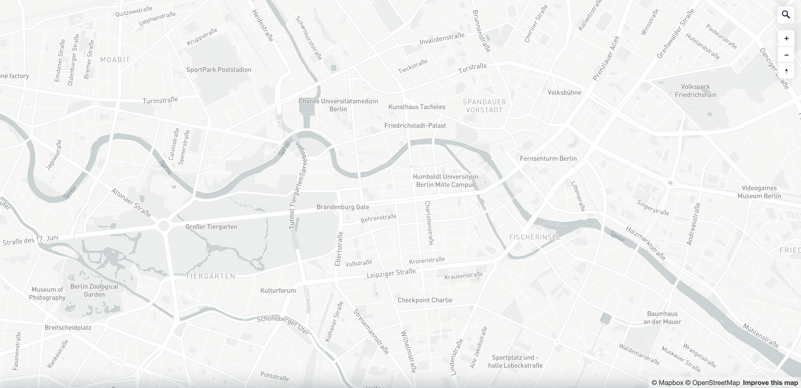
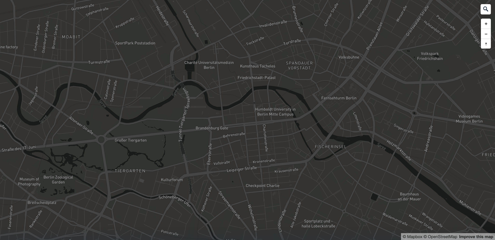

Design-Themen
=============

Mithilfe von Design-Themen können vorhandene Komponenten an einen bestimmten
visuellen Stil angepasst werden. Dabei werden im Cusy Design System meist nur
eine Reihe universeller Variablen geändert und die meisten Komponenten passen
sich dann automatisch an. Lediglich in Ausnahmefällen müssen einzelne
Komponenten geändert werden.

Das Cusy Design System bietet zwei verschiedene Design-Themen, wie auf der Seite
:doc:`viz/colors` gezeigt: *Dark* und *Light*. Beide Themen können in CSS
angegeben werden mit:

.. code-block:: css

    :root {
        color-scheme: light dark;
    }

Um nicht die Farbe jedes Elements im DOM überschreiben zu müssen, sollten die
CSS-Anweisungen bei benutzerdefinierten Eigenschaften oder Variablen beginnen:

.. code-block:: css

    :root {
        --background-color: #161616;
        --text-color: #f4f4f4;
        --link-color: #78a9ff;
    }
    body {
        background-color: var(--background-color);
        color: var(--text-color);
    }
    a {
        color: var(--link-color);
    }

Das *Light*-Thema wird dann in einer ``@media``-Anweisung definiert:

.. code-block:: css

    @media (prefers-color-scheme: light) {
        :root {
            --background-color: #ffffff;
            --text-color: #161616;
            --link-color: #0f62fe;
        }
    }

Dabei ist jedoch zu beachten, dass Grafiken und Bilder auf unterschiedlichen
Hintergründen meist anders dargestellt werden sollten. Für SVG-Dateien können
die Farben einfach überschrieben werden, :abbr:`z.B. (zum Beispiel)` mit:

.. code-block:: css

    svg.activity-sparkline path {
        stroke: var(--text-color);
    }

Bei Fotos genügt im allgemeinen, sie etwas aufzuhellen und den Kontrast zu
reduzieren:

.. code-block:: css

    @media (prefers-color-scheme: light) {
        img {
            filter: brightness(1.24) contrast(0.81);
        }
    }

Manchmal lassen sich bestehende Bilder jedoch nicht einfach optimieren und
sollten dann durch andere Bilder ersetzt werden:

.. code-block:: html

    <picture>
        <source
            srcset="light.png"
            media="(prefers-color-scheme: light)"></source>
            
    </picture>

Schließlich stehen auch für die Darstellung von `mapbox
<https://www.mapbox.com/maps/>`_-Karten ein `Dark Mode
<https://www.mapbox.com/maps/dark>`_ und ein `Light Mode
<https://www.mapbox.com/maps/light>`_ zur Verfügung. Diese können  verwendet
werden mit:

.. code-block:: html

    <picture>
        <source
            media="(prefers-color-scheme: light)"
            srcset="https://api.mapbox.com/styles/v1/mapbox/light-v10/static…">
        
    </picture>

.. seealso::

    * `Mozilla web docs: Using CSS custom properties (variables)
      <https://developer.mozilla.org/en-US/docs/Web/CSS/Using_CSS_custom_properties>`_
    * `Mozilla web docs: prefers-color-scheme
      <https://developer.mozilla.org/en-US/docs/Web/CSS/@media/prefers-color-scheme>`_
    * `Material System: Dark theme
      <https://material.io/design/color/dark-theme.html>`_

