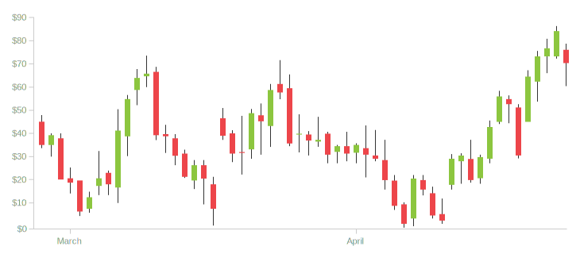
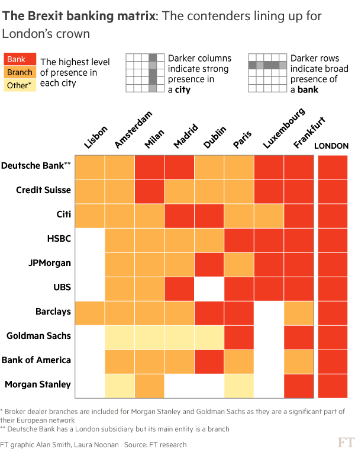
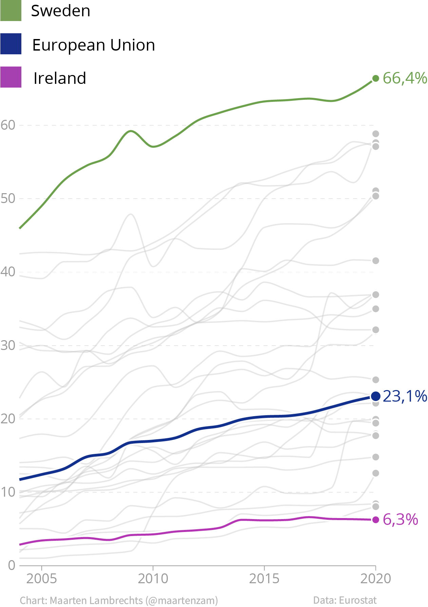

Kognitive Belastung
===================

    »Die kognitive Belastung beschreibt den Umfang des Arbeitsspeichers, den
    eine Person verwendet, wenn sie neue Informationen aufnimmt und sie in das
    Langzeitgedächtnis überträgt. Vereinfacht ausgedrückt, hilft uns die
    kognitive Belastung dabei zu beurteilen, wie leicht oder schwer es für
    jemanden ist, etwas Neues zu verstehen.«

– Eva Sibinga, Erin Waldron: `Cognitive Load as a Guide: 12 Spectrums to Improve
Your Data Visualizations
<https://nightingaledvs.com/cognitive-load-as-a-guide-12-spectrums-to-improve-your-data-visualizations/>`_

Die kognitive Belastung wird in drei Arten unterteilt, die alle für die
Datenvisualisierung relevant sind:

Intrinsische Belastung
    Die intrinsische Belastung der in einer Visualisierung dargestellten Daten
    kann je nach Anzahl der Datensätze und Anzahl der Dimensionen hoch oder
    niedrig sein.

    .. figure:: gapminder.png
       :alt: Ein Blasendiagramm mit fünf Dimensionen: Einkommen auf der x-Achse,
             Lebenserwartung auf der y-Achse, Region als Farbe, Bevölkerung als
             Blasengröße und Ländername in den Tooltips.

       Quelle: `gapminder.org/tools
       <https://www.gapminder.org/tools/#$chart-type=bubbles&url=v2>`_

Extrinsische Belastung
----------------------

Die extrinsische kognitive Belastung ergibt sich aus der Art und Weise, wie die
neuen Informationen präsentiert werden. Sie ist abhängig vom Design der
Datenvisualisierung. In den meisten Fällen möchtet ihr die gesamte kognitive
Belastung so gering wie möglich halten, um es eurem Publikum so einfach wie
möglich zu machen. Dabei haben Datenvisualisierungen schon eine viel geringere
extrinsische kognitive Belastung als tabellarische oder textuelle Daten.
Zusätzliche Informationen, wie aggregierte Werte und Textelemente, die erklären,
wie das Diagramm gelesen und wie bestimmte Werte erklärt werden können, gut
verständlichen Diagrammtitel, visuelle und textuelle Anmerkungen können die
kognitive Belastung noch deutlich weiter verringern.

.. figure:: ingraham-co2-levels.jpg
   :alt: CO, Werte in einem besetzten Konferenzraum am 4. Juni 2019

   Die Grafik zeigt die CO₂-Konzentration in einem Konferenzraum an einem
   Vormittag. Das Design ist einfach und klar, aber es gibt eine Menge zu tun,
   bevor das Diagramm vollständig verstanden werden kann:

   * Hilfreicher Titel
   * Einheiten und Methode im Untertitel, nicht in der Legende versteckt
   * Beschreibungen innerhalb der Grafik
   * Gestrichelte Schwellenwertlinien zur besseren Unterscheidung
   * Zeitleiste mit bedeutungsvollem Startpunkt und relevanten Beschreibungen
   * Quellangabe

Lernbezogene Belastung
----------------------

Die lernbezogene kognitive Belastung ist die Anstrengung, die euer Publikum
aufbringen muss, um die neue Information in ihr mentales Modell zu übernehmen.

Ein Datensatz über das Bruttoinlandsprodukt und die Produktivität von Ländern
werden erfahrene Wirtschaftswissenschaftler*innen viel leichter verstehen als
Schüler*innen – die lernbezogene Belastung unterscheidet sich für beide Gruppen
deutlich.

Auch die Verwendung von weniger gebräuchlichen Diagrammtypen kann zu einer
höheren lernbezogenen Belastung führen. Aktienhändler*innen können in
Candlestick-Diagrammen vermutlich sofort die Tage erkennen, an denen die Aktien
verkauft oder gekkauft werden sollen. Andere werden einige Zeit mit dem Diagramm
benötigen, bevor sie es verstehen können:

   Quelle: `datavizcatalogue.com/methods/candlestick_chart.html
   <https://datavizcatalogue.com/methods/candlestick_chart.html>`_

Einige Konzepte der Theorie kognitiver Belastung, die im Bildungsbereich
verwendet werden, lassen sich gut in die Datenvisualisierung übertragen:

Pre-Teaching (Vorunterricht)
~~~~~~~~~~~~~~~~~~~~~~~~~~~~

Dies ist eine Unterrichtsstrategie, bei der Studierenden das Vokabular
vermittelt wird, bevor der eigentliche Unterricht beginnt. Der Inhalt der Daten
kann dann auf dem vertrauten neuen Vokabular aufbauen, die kognitive Belastung
durch den neuen Inhalt wird nicht mehr durch das neue Vokabular verstärkt.

Effekt der geteilten Aufmerksamkeit (Chunking)
~~~~~~~~~~~~~~~~~~~~~~~~~~~~~~~~~~~~~~~~~~~~~~

Der Effekt der geteilten Aufmerksamkeit tritt auf, wenn das Publikum seine
Aufmerksamkeit zwischen zwei oder mehr voneinander abhängigen
Informationsquellen aufteilen soll. Dies kann ein Text und eine Visualisierung
sein, die entweder räumlich oder zeitlich voneinander getrennt sind.

Um die Daten effektiv interpretieren zu können, sollten die einzelnen
Informationsquellen möglichst gut integriert werden:

* Einheiten und andere kontextbezogene Informationen sollten in die
  Visualisierung integriert werden.
* Eine direkte Beschriftung ist der Verwendung separater Farblegenden
  vorzuziehen.

