Farbpaletten
============

Die Farbpalette für Datenvisualisierungen ist eine ausgewählte Teilmenge der
cusy-Design-Farbpalette. Sie wurde entwickelt, um die Zugänglichkeit und
Harmonie innerhalb einer Seite zu verbessern.

Kategorien
..........

Kategoriale (oder qualitative) Paletten eignen sich am besten, wenn Sie diskrete
Datenkategorien unterscheiden sollen, die keine inhärente Korrelation aufweisen.

Die Farben dieser Palette sollten nacheinander genau wie unten beschrieben
angewendet werden. Die Sequenz wird sorgfältig kuratiert, um den Kontrast
zwischen benachbarten Farben zu maximieren und die visuelle Unterscheidung zu
erleichtern.

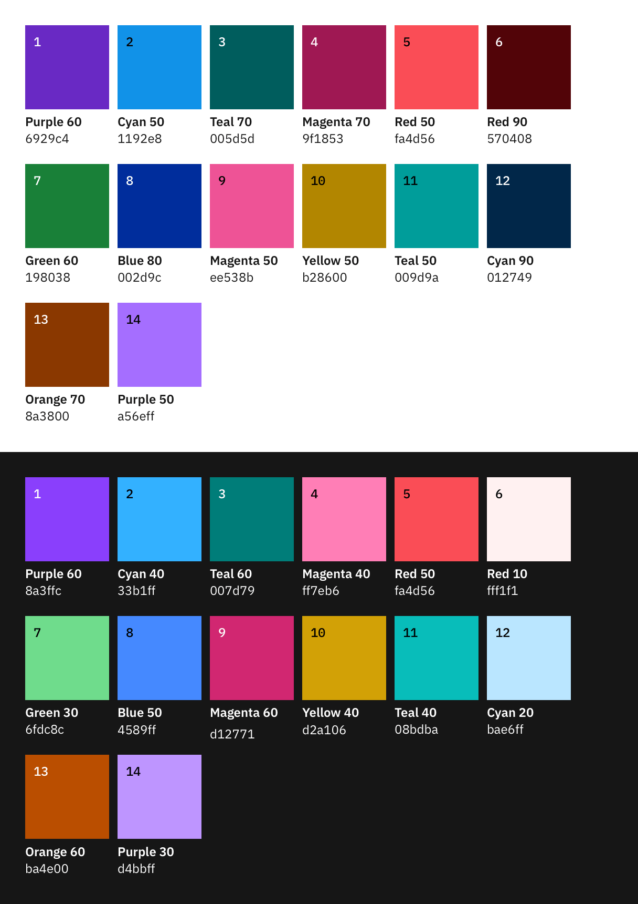

Alternativen für das Light Theme
--------------------------------

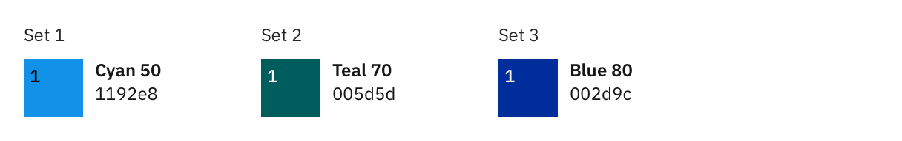

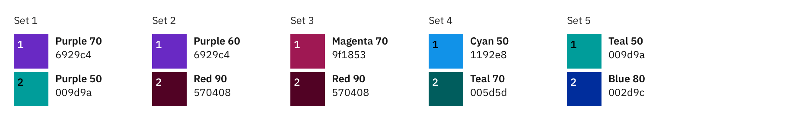

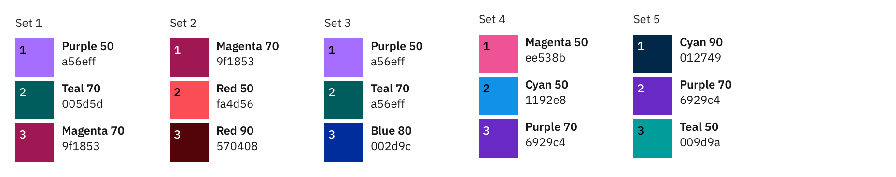

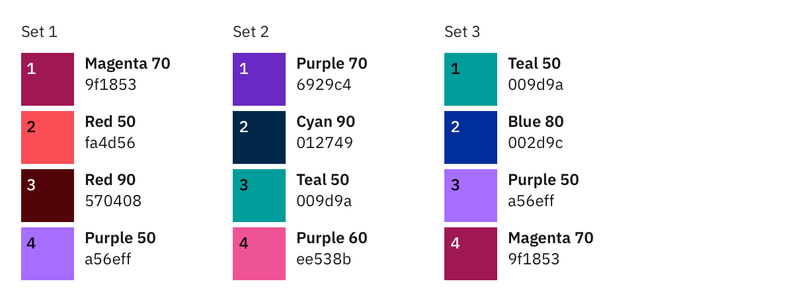

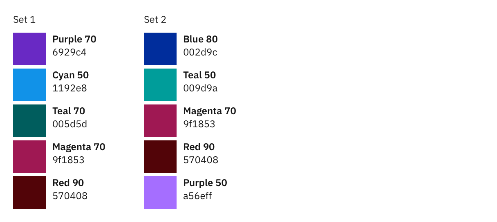

Alternativen für das Dark Theme
-------------------------------

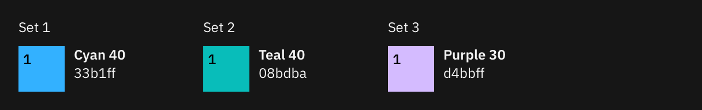

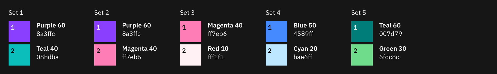

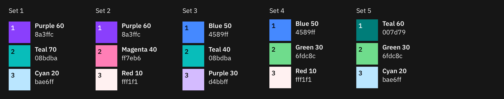

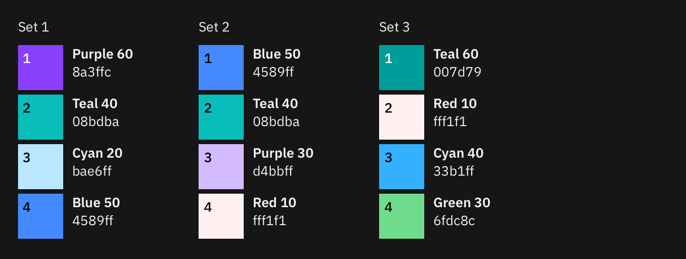

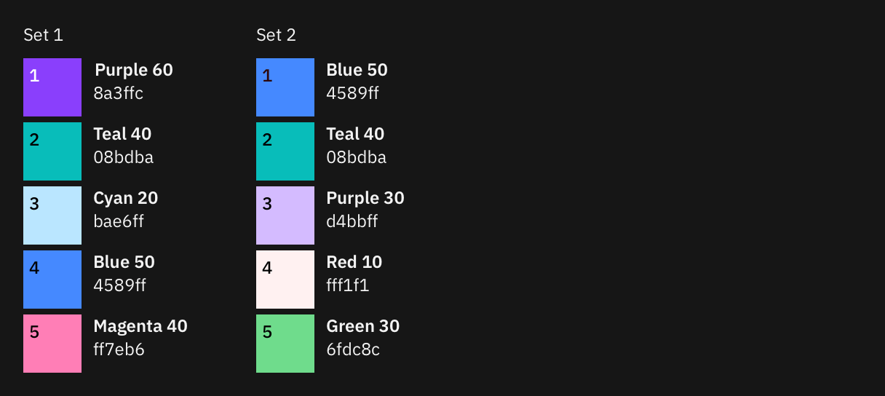

Sequenzen
---------

Einfarbig
~~~~~~~~~

Monochromatische Paletten eignen sich gut für Beziehungs- und Trenddiagramme.
Beim hellen Theme bezeichnet die dunkelste Farbe die größten Werte. In dunklen
Themes bezeichnet die hellste Farbe die größten Werte.

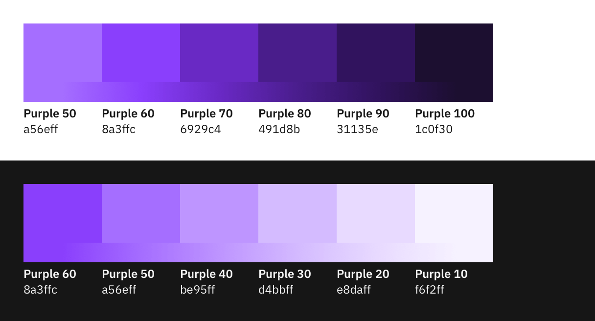
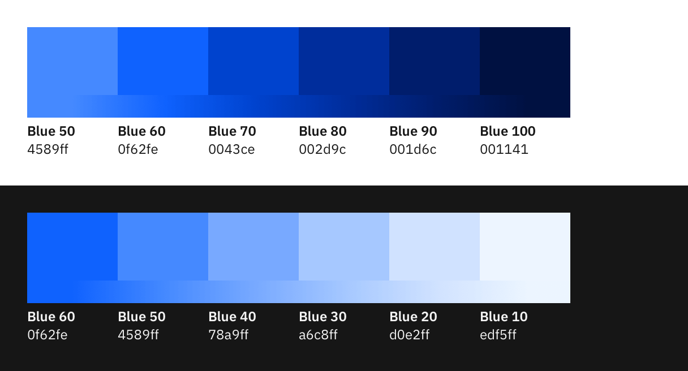

Warm-Kalt
~~~~~~~~~

Die Rot-Cyan-Palette hat einen natürlichen Zusammenhang mit der Temperatur.
Verwendet diese Palette für Daten, die heiß-vs-kalt darstellen sollen.

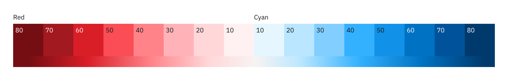

Verläufe ohne Farbassoziationen
~~~~~~~~~~~~~~~~~~~~~~~~~~~~~~~

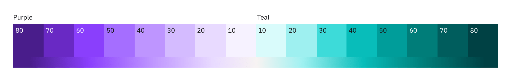

Alarm
~~~~~

Warnfarben werden verwendet, um den Status wiederzugeben. In der Regel steht Rot
für Gefahr oder Fehler. Orange ist eine ernsthafte Warnung. Gelb steht für eine
einfache Warnung und Grün für Normal oder Erfolg.

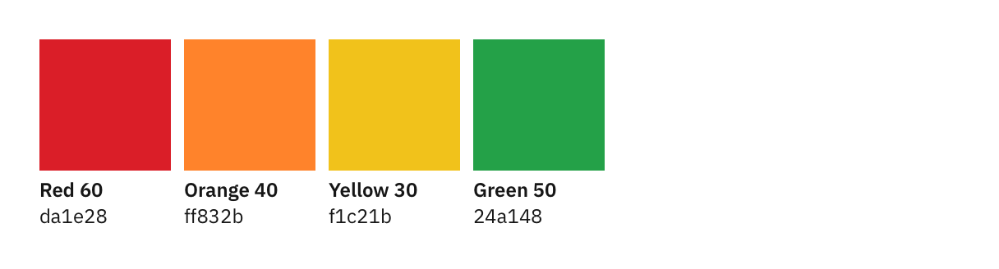

Farbverlauf
~~~~~~~~~~~

Farbverläufe eignen sich gut zum Hervorheben von Extremen in einem Wertebereich.
Verwendet einen Verlauf nur bei Bedarf für Visualisierungen einzelner
Kategorien. Mehrere Farbverläufe sind oft nicht zugänglich und nur selten
empfehlenswert. Farbverläufe sollten nicht verwendet werden, um eine Progression
oder Divergenz darzustellen.

.. note::
    Verwendet niemals einen Farbverlauf anstelle einer sequentiellen Palette.

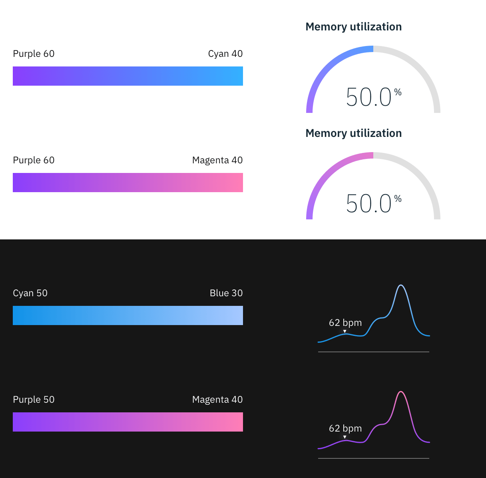

