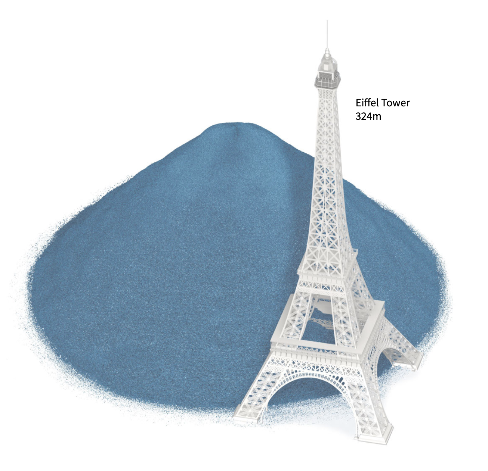
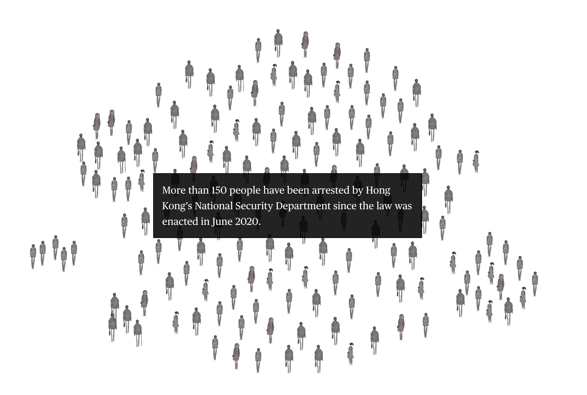
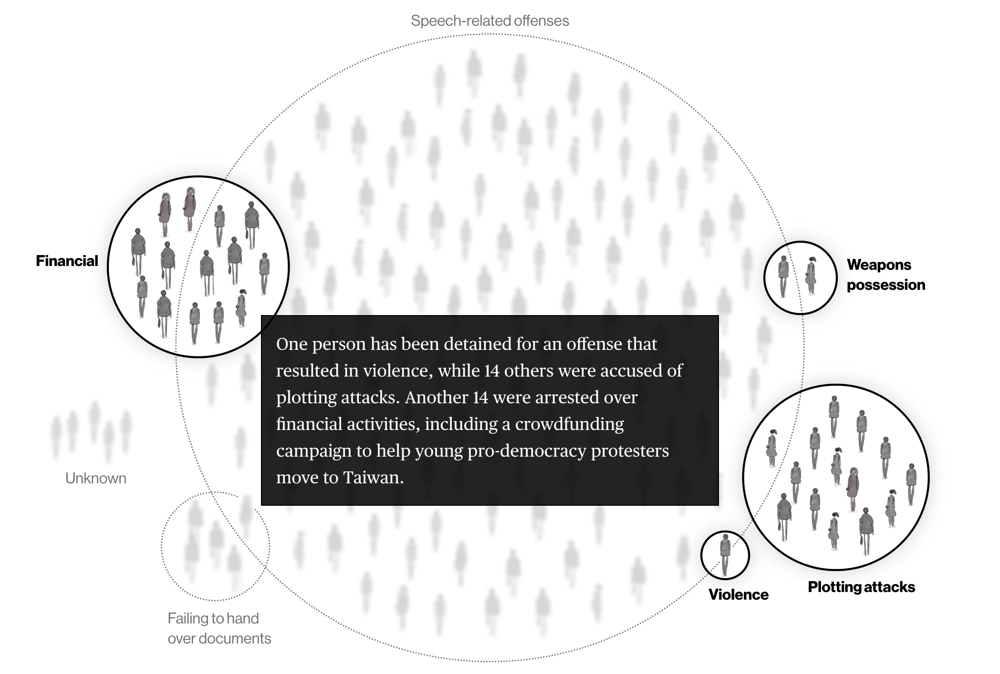
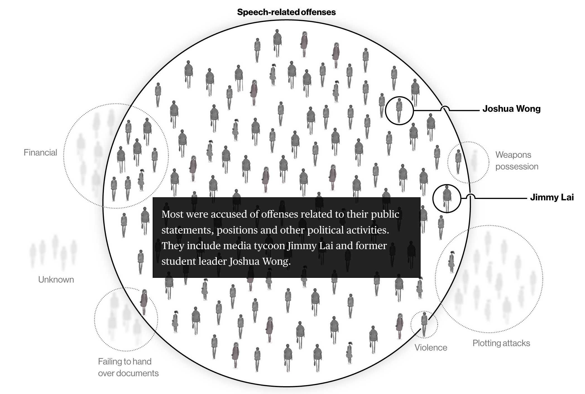
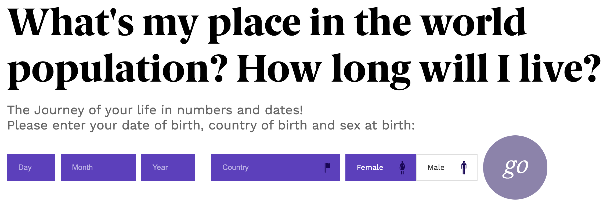
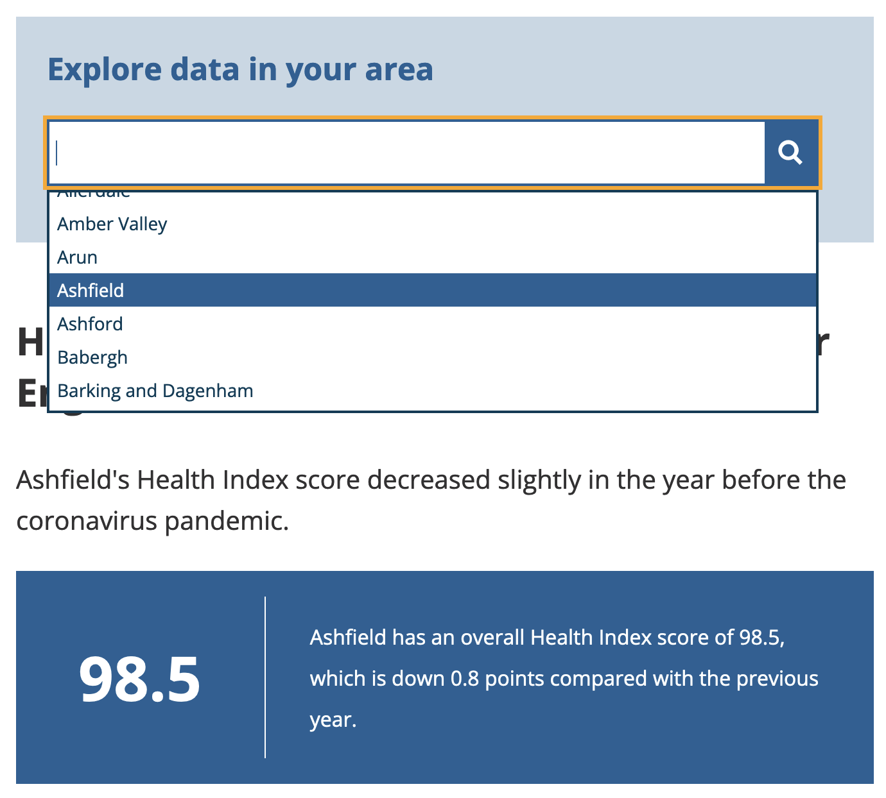

Data-Storytelling
=================

Die meisten Data-Stories haben folgende Elemente gemeinsam:

* Kontext
* Figur
* Ereignisse
* Wirkung

   Quelle: `Drowning in Plastic, Reuters
   <https://www.reuters.com/graphics/ENVIRONMENT-PLASTIC/0100B275155/>`_

Um große Zahlen wie diese verständlich zu machen, können sie in Einheiten
umgerechnet werden, mit denen Menschen vertraut sind. Das britische Office for
National Statistics (ONS) hat einen *Context Calculator* veröffentlicht, mit dem
sich große Geldbeträge in eine vertraute Perspektive umrechnen lassen.

.. raw:: html

   <iframe src="https://www.ons.gov.uk/visualisations/dvc685/calculator/index.html" width="100%" height="650px" style="border: medium;"></iframe>

* :abbr:`ONS (Office for National Statistics)`-Nettobeitrag
* Nettobeitrag der Europäischen Kommission
* % der Staatsausgaben 2018

Journalistische Techniken
-------------------------

Die umgekehrte Pyramide
~~~~~~~~~~~~~~~~~~~~~~~

Die umgekehrte Pyramide ist eine Metapher zur Strukturierung von
Nachrichtenartikeln.

#. Die wichtigsten und interessantesten Informationen eines Artikels sollten
   demnach bereits in den ersten Sätzen enthalten sein. Eine hilfreiche Technik,
   um zu bestimmen, was diese Botschaft enthalten sollte, ist eine andere
   journalistische Technik, *die fünf W’s*:

   Wer, Was, Wann, Wo und Warum

#. Details können später im Text folgen.

#. Zusätzliche Hintergrundinformationen sollten zuletzt erwähnt werden.

.. raw:: html
   :file: inverted-pyramid.svg

.. raw:: html

   

Mantra der visuellen Informationssuche
~~~~~~~~~~~~~~~~~~~~~~~~~~~~~~~~~~~~~~

Das Mantra der visuellen Informationssuche wurde 1996 von Ben Shneiderman
geprägt: `The Eyes Have It: A Task by Data Type Taxonomy for Information
Visualizations <https://www.cs.umd.edu/~ben/papers/Shneiderman1996eyes.pdf>`_.

    „Interessanterweise entspricht das journalistische Dreieck mehr oder weniger
    dem Mantra interaktiver Grafiken: **zuerst Überblick, zoomen und filtern,
    und Details auf Anfrage**“

– Barbara Tversky in `Data-Driven Storytelling
<https://www.routledge.com/Data-Driven-Storytelling/Riche-Hurter-Diakopoulos-Carpendale/p/book/9781138197107>`_

Das Mantra der visuellen Informationssuche wurde mit Blick auf die interaktive
und explorative Datenvisualisierung entwickelt, gilt aber auch für die
erklärende Datenvisualisierung. Demzufolge sollte zunächst ein Überblick gegeben
werden. In einer datengetriebenen Geschichte kann eine Visualisierung des
längerfristigen Trends oder der Gesamtverteilung oder der Beziehungen in einer
Datenvisualisierung gezeigt werden, um den Kontext zu skizzieren und das Thema
und die Daten vorzustellen. Alle Datenpunkte werden angezeigt. Die Übersicht
kann auch aus einer einzelnen Schlüsselkennzahl bestehen, wie einem globalen
Durchschnitt oder einer Gesamtsumme.

Dann kommen Zoom und Filter: Die Sicht auf die Daten wird so verändert, dass
interessante Elemente in den Daten in den Fokus rücken und uninteressante
Elemente herausgefiltert werden. Ausreißer werden hervorgehoben, Korrelationen
werden angezeigt, kleinere interessante Muster werden kommentiert, die
Gesamtsumme wird in ihre Komponenten zerlegt, etc.

         Personen von Hongkongs Abteilung für nationale Sicherheit verhaftet.

   Quelle: `Bloomberg: How Hong Kong’s National Security Law Is Changing
   Everything
   <https://www.bloomberg.com/graphics/2021-hong-kong-national-security-law-arrests/>`_

         wurden der Planung von Anschlägen beschuldigt. Weitere 14 Personen
         wurden wegen finanzieller Aktivitäten verhaftet, darunter eine
         Crowdfunding-Kampagne zur Unterstützung junger pro-demokratischer
         Demonstranten bei der Ausreise nach Taiwan.

         öffentlichen Äußerungen, Positionen und anderen politischen Aktivitäten
         angeklagt. Dazu gehören der Medienmagnat Jimmy Lai und der ehemalige
         Studentenführer Joshua Wong.

Anthropografie
--------------

Bei der Darstellung von Daten über Menschen, wie im vorigen Beispiel über
verhaftete Menschen in Hongkong, helfen, sich mit diesen Menschen zu
identifizieren. Hierfür wurde der Begriff Anthropografie erst kürzlich geprägt,
um in Datenvisualisierungen Empathie zu wecken.

Persönliche Ansprache
---------------------

Das Publikum sollte sich selbst in den Daten wiederfinden. Mit *Zoom* und
*Filter* können die für eine einzelne Person wichtigsten Daten visualisiert
werden, :abbr:`z.B. (zum Beispiel)`:

* lokale Statistiken
* der Wirtschaftszweig, in dem sie arbeiten
* Schlüsselzahlen für ihre Altersgruppe

Viele Titel interaktiver Charts sprechen die Leser*innen direkt an und laden sie
ein, selbst zu interagieren und ihre eigenen Daten zu finden. Ein Beispiel für
diese Technik ist `population.io <https://population.io/>`_:

         »Wie groß ist mein Anteil an der Weltbevölkerung? Wie lange werde ich
         leben?«

:abbr:`ONS (Office for National Statistics)` hat das „You“ in die Überschrift
von *How health has changed in your local area* gesetzt:

         die Daten in deinem Gebiet“ über einem großen Suchfeld mit
         Dropdown-Liste.

Nach der Auswahl des Interesses werden Text und Visualisierungen des Artikels
aktualisiert und konzentrieren sich auf den ausgewählten Bereich.

.. CSS:
.. raw:: html

   
