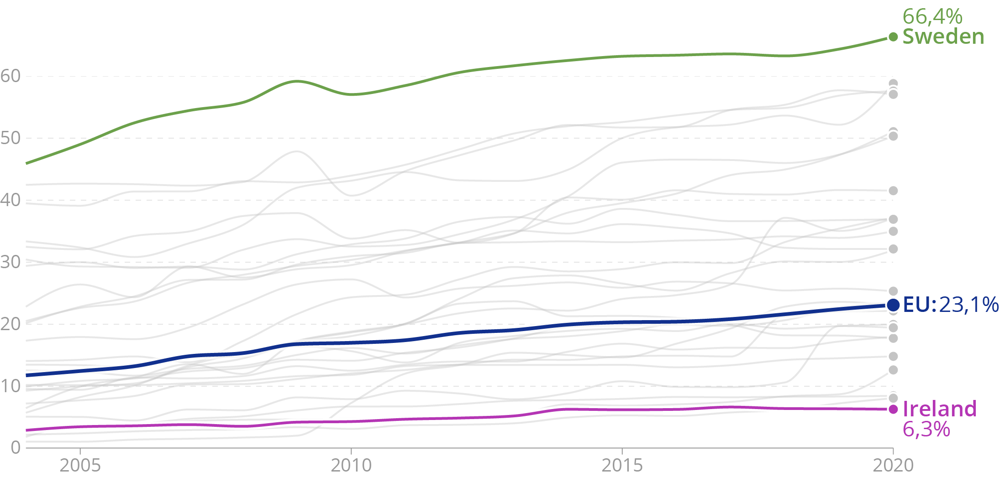
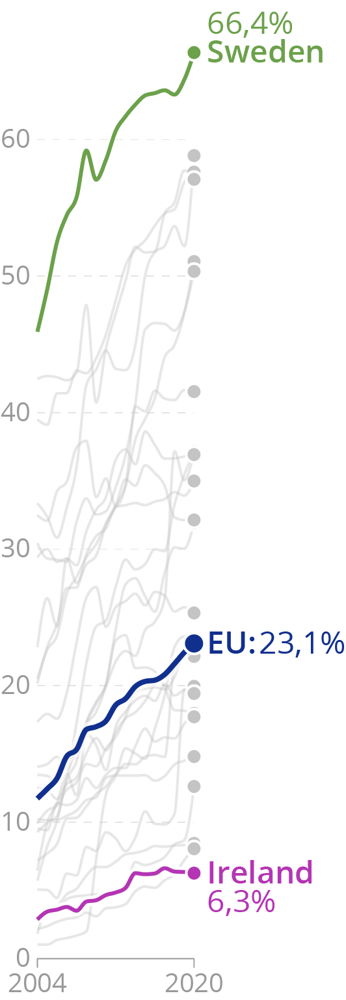
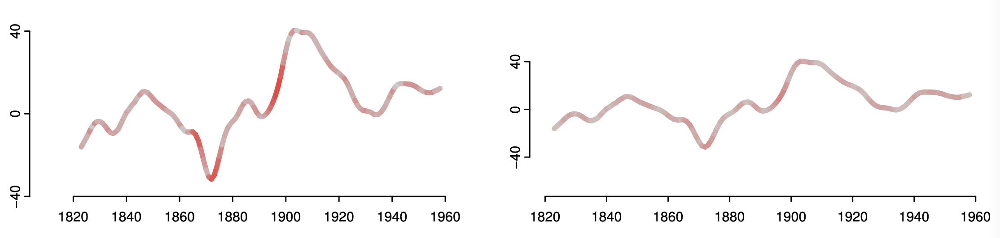
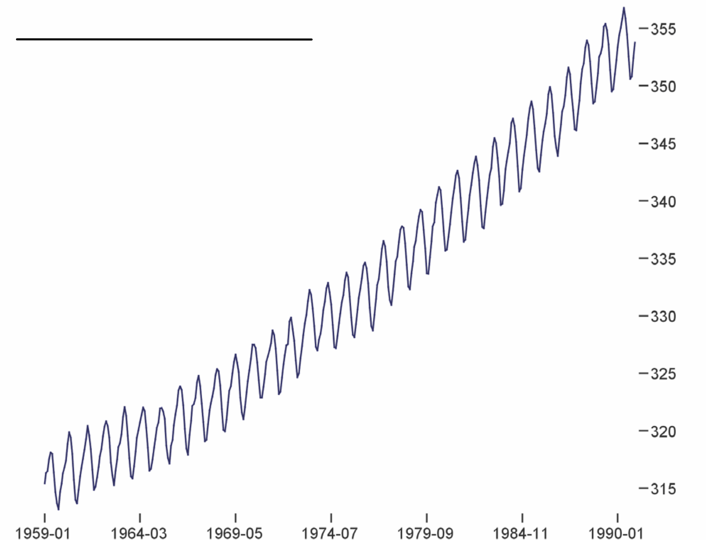
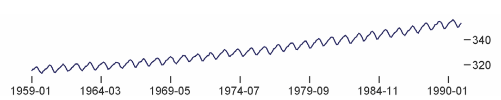

Seitenverhältnisse
==================

Layout
------

.. raw:: html

   <iframe title="Where the population of Europe is growing, and where it’s declining " aria-label="Map" id="datawrapper-chart-iUPVd" src="https://datawrapper.dwcdn.net/iUPVd/5/" scrolling="no" frameborder="0" style="width: 0; min-width: 100% !important; border: none;" height="585"></iframe>

Wenn der Platz begrenzt ist, können die Anmerkungen unterhalb der Visualisierung
aufgelistet werden:

.. raw:: html

   <iframe title="Where the population of Europe is growing, and where it’s declining " aria-label="Map" id="datawrapper-chart-iUPVd" src="https://datawrapper.dwcdn.net/iUPVd/5/" scrolling="no" frameborder="0" style="width: 300; border: none;" height="585"></iframe>
   

Liniendiagramme
---------------

Ein breites Layout verflacht Trends in Zeitreihen:

         farblich hervorgehobenen Linien

Ein hohes Layout bewirkt das Gegenteil und betont oder dramatisiert Trends in
den Daten:

         Layout.

Was ist also ein „gutes“, „richtiges“ oder „ehrliches“ Seitenverhältnis für
Liniendiagramme? Oft zitiert wird hierfür die sogenannte 45-Grad-Regel: Sie
besagt, dass die durchschnittliche Neigung der Linien in einem Diagramm 45 Grad
betragen sollte. Diese Regel geht auf die Studie `The Shape Parameter of a
Two-Variable Graph <https://www.jstor.org/stable/2288843>`_ zurück. Das Thema
der Studie war jedoch, wie gut Menschen in der Lage waren, die Neigungen zweier
Linien in einem Diagramm zu vergleichen. Es ging also nicht darum, Erkenntnisse
aus einer einzelnen Zeitreihe zu gewinnen oder in einem Liniendiagramm mit
vielen Zeitreihen das große Ganze zu sehen. Zudem wurden in der Studie keine
durchschnittlichen Steigungen von weniger als 45 Grad berücksichtigt.

         gestaucht ist.

   Beide Diagramme zeigen die gleichen Daten. Je intensiver das Rot ist, desto
   größer ist der Fehler beim Vergleich der Steigung eines Chart-Segments mit
   anderen Segmenten. Ein flacheres Layout führt zu geringeren Fehlern.

Trotz der Unzulänglichkeiten der anfänglichen Studie könnte eine 45-Grad-Regel
immer noch eine gute Ausgangsbasis für gut lesbare Diagramme sein.

Die Studie `Multi-Scale Banking to 45°
<http://vis.berkeley.edu/papers/banking/2006-Banking-InfoVis.pdf>`_ zeigte, dass
bei unterschiedlichen Seitenverhältnissen unterschiedliche Signale in Zeitreihen
wahrgenommen werden. Unten sind zwei Diagramme zu sehen, die dieselben Daten
zeigen: die CO₂-Konzentration in einer Messstation auf Hawaii. Die Daten in
beiden Diagrammen zeigen einen Aufwärtstrend mit jährlichen, saisonalen Zyklen:

         1990. Ein jährlicher Zyklus liegt über einen kontinuierlich steigenden
         Trend.

   Das Diagramm hat ein mehr oder weniger quadratisches Layout. Auf diesem
   Diagramm kann man den Aufwärtstrend in der Zeitreihe gut erkennen: Der
   jährliche Anstieg der CO₂-Konzentration beschleunigt sich.

         komprimiert.

   Das zweite Diagramm hat ein flaches Layout. Der Aufwärtstrend ist weniger
   sichtbar als im vorigen Diagramm. Dafür wird jedoch etwas anderes deutlicher:
   Die saisonalen Abnahmen der CO₂-Konzentration sind steiler als die saisonalen
   Zunahmen.
