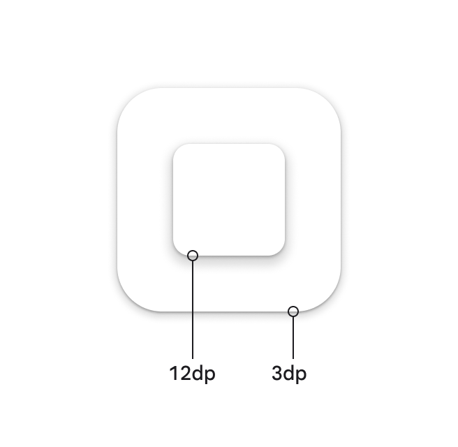
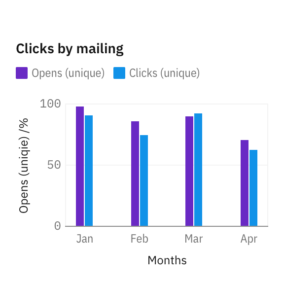
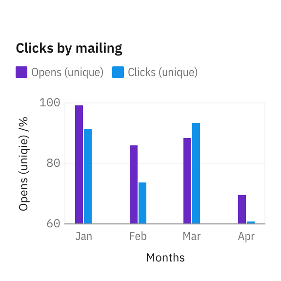
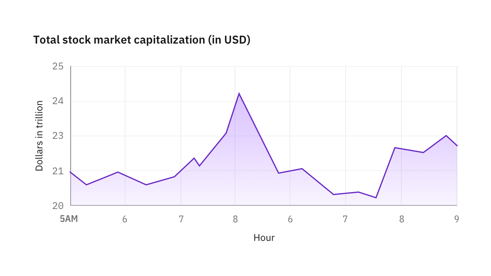
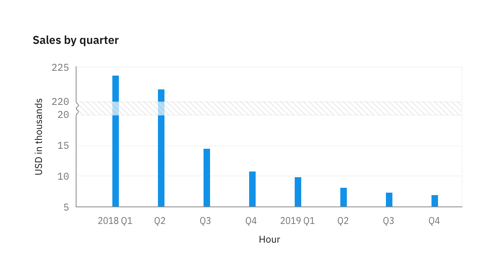
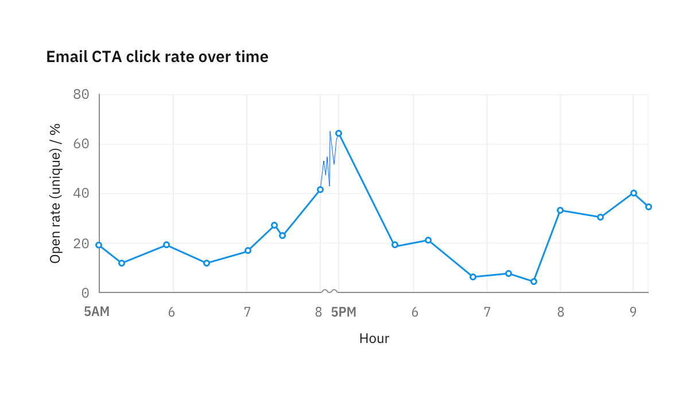
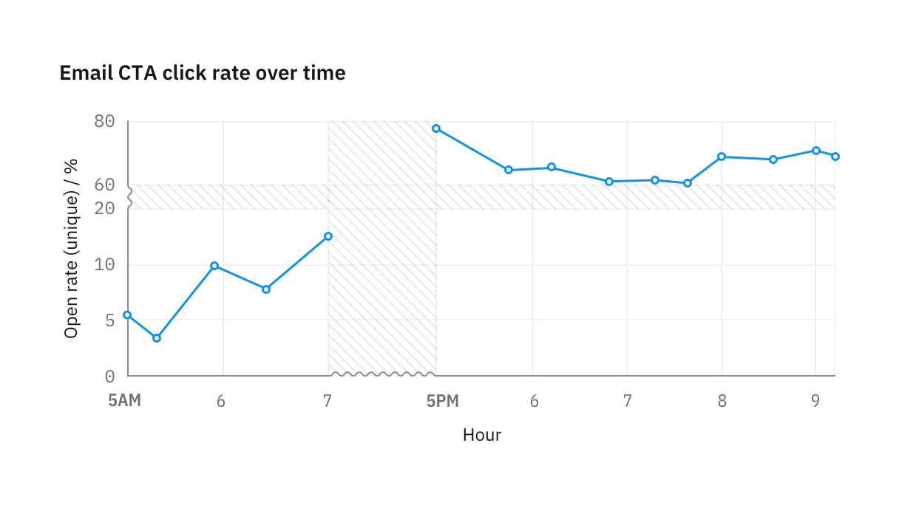
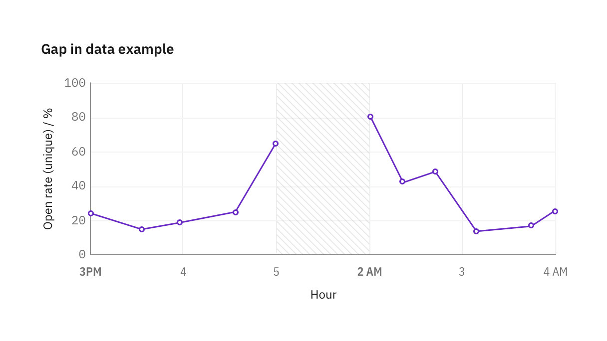
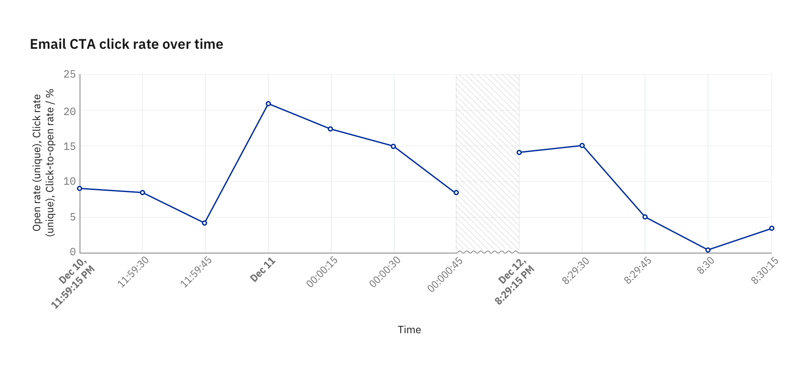

Achsen
======

Achsen und Beschriftungen bieten einen kritischen Kontext für Informationen in
einem Diagramm. Verwendet einfache, leicht verständliche Beschreibungen und
Metriken, um euer Diagramm und eure Achsen zu kennzeichnen.

.. _z-axis:

z-Achse
-------

Die z-Achse kann durch verschiedene Techniken simuliert werden:

Ebenen
~~~~~~

Viele visuelle Designprogramme wie GIMP, Adobe Photoshop und Illustrator
verwenden die Metapher der Ebenen für die Verwaltung der verschiedenen Elemente
eines Designs. Ebenen werden jedoch auch in geografischen Informationssystemen
verwendet:

.. figure:: map_layers.png
   :alt: Illustration der Ebenen einer Karte

Dabei gibt es einige grundlegende Regeln, wie Elemente der Diagrammanatomie und die Datenpunkte übereinander gestapelt werden sollten:

#. Der gesamte Text sollte sich über allen anderen Ebenen befinden.
#. Datenmarkierungen (Punkte, Kreise, Balken, Linien, …) sollten über
   unterstützenden Elementen, wie Gitternetzlinien, liegen.
#. Wenn sich Datenmarkierungen überlappen können, stellt sicher, dass kleinere
   Elemente über größere gezeichnet werden.

   Alternativ kann eine leichte Transparenz der überdeckenden Elemente die
   darunter liegenden Elemente durchscheinen lassen.

Schatten
::::::::

In Material Design 2 wird die z-Achse mit Schatten simuliert:

   Quelle: `Elevation <https://m3.material.io/styles/elevation/overview#f9947307-4818-4d94-b98a-fa1cb5498eb1>`_

Farbe
:::::

In Material Design 3 wird für die Simulation der z-Achse hingegen :ref:`Farbe
<colour-hierarchy>` verwendet.

Beginnend mit Null
------------------

Bei Teil-zu-Ganzes- und Vergleichsdiagrammen sollten die numerischen Achsen
immer bei Null beginnen. Und auch bei Balken- und Flächendiagrammen kann eine
abgeschnittene Achse die wahrgenommene Skalierung eines Diagramms verzerren,
sodass ein kleiner Unterschied signifikanter erscheint als er tatsächlich ist.

   Bei Balkendiagrammen sollte die numerische Achse bei Null beginnen.

   Wenn eine Achse nicht bei Null beginnt, sind die prozentualen Unterschiede
   zwischen den Balken übertrieben.

Linien- und Streudiagramme können jedoch mit einem Wert über Null starten. Diese
Arten von Visualisierungen reagieren weniger empfindlich auf Verzerrungen, da
sie eher Trends als Unterschiede in Größe oder Menge kommunizieren. In diesen
Fällen hilft das Zuschneiden der Y-Achse dem Betrachtern, die Änderungsrichtung
besser zu identifizieren.

   Für Liniendiagramme, in denen Trends angezeigt werden, ist das Vorhandensein
   von Spitzen und Tälern wichtiger als die wahre Größe der Änderung.

   Durch Verläufe, die am gedachten Nullpunkt keine Sättigung aufweisen, sind
   dann völlig ausreichend um zu visualisieren, dass die Werte nicht bei Null
   starten.

Lücken
------

Manchmal ist es nützlich, einen Teil der Achse zu überspringen, um Daten an den
äußersten Enden ohne Verzerrung sichtbar zu machen. Wenn Achsen einen Bruch
enthalten, wird die gerade Achsenlinie durch eine Sinuslinie ersetzt.

Auf der X-Achse kann die Unterbrechung fließend sein, sollte jedoch 16px nicht
unterschreiten. Auf der Y-Achse sollte die Distanzunterbrechung exakt 16px
betragen.

   Wenn während eines Achsenbruchs Daten verfügbar sind, solltet ihr die
   Liniensegmente so anpassen, dass sie eine Sättigung von 50% erhalten;
   Kreise und Datenpunkte sollten hingegen verborgen werden.

   Wenn zwischen den Datenpunkten keine Daten verfügbar sind, wird die Lücke
   mit einer Textur gekennzeichnet.

Datenlücken
~~~~~~~~~~~

Um den Bereich oder Zeitraum anzugeben, in dem keine Daten verfügbar sind, kann
eine Textur verwendet werden. Beschriftet immer die Start- und Endpunkte, an
denen keine Daten verfügbar sind.

Zeitfolgen
----------

Konsistente Inkremente
~~~~~~~~~~~~~~~~~~~~~~

Wenn eine Form der Achsenkomprimierung erforderlich ist, verwendet das
bereitgestellte `Achsenbruch <#lucken>`_-Styling, um die Komprimierung
darzustellen.

Lokalisierung
~~~~~~~~~~~~~

In Zeitreihen spiegeln die Beschriftungen der X-Achse das Zeitinkrement in den
Daten wider. Verwendet nach Möglichkeit das lokalisierte Datums- und
Uhrzeitformat oder die Benutzereinstellungen. Andernfalls verwendet das Diagramm
standardmäßig das ISO 8601-Format ``YYYY-MM-DD hh:mm:ss``.

Orientierungspunktetiketten
~~~~~~~~~~~~~~~~~~~~~~~~~~~

Wenn Daten in einen neuen Zeitzyklus übergehen, :abbr:`z.B. (zum Beispiel)`
einen neuen Tag, einen neuen Monat oder ein neues Jahr, wird das Etikett
halbfett beschriftet, um den Übergang hervorzuheben.

   Beispiel einer Zeitreihe in Intervallen von 15 Sekunden
