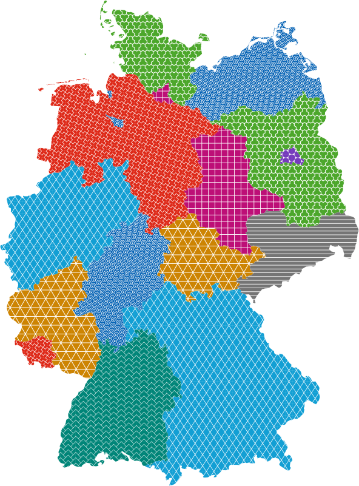
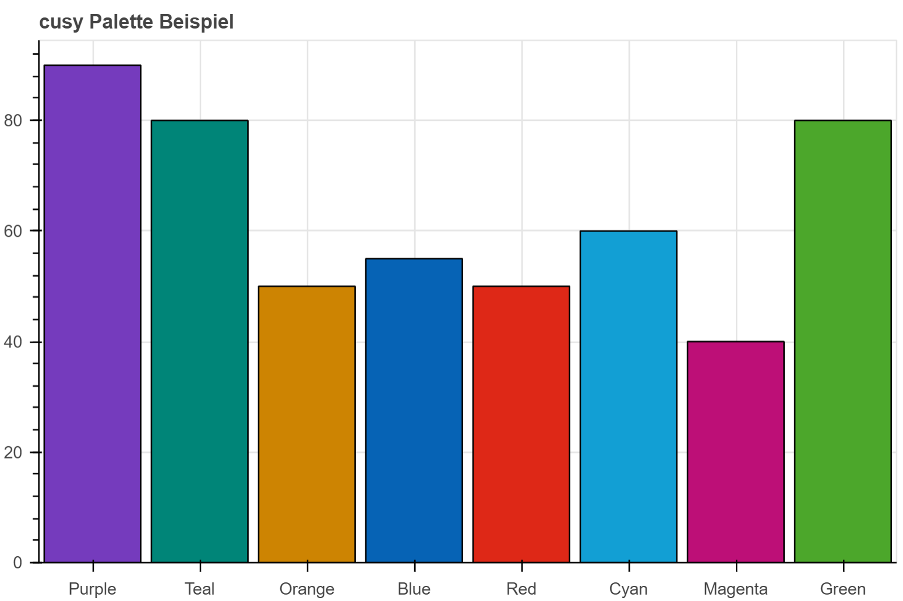
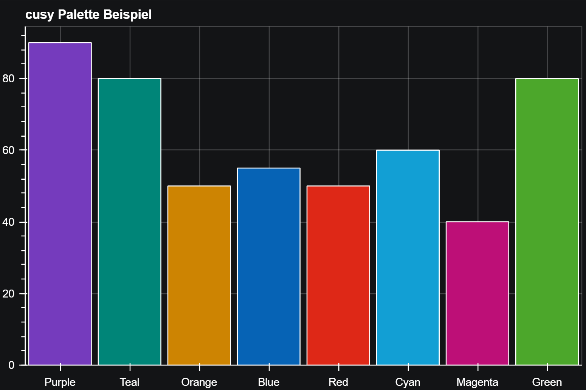

Farbe
=====

Farbe ist ein starker Gestaltungsmechanismus zur Schaffung einer visuellen
Hierarchie. Sie kann signalisieren, welches die wichtigsten Elemente in einer
Datenvisualisierung sind. Ein gängiges Muster ist die Verwendung

#. einer auffälligen Farbe zur Hervorhebung und Kennzeichnung der
   Datenmarkierungen oder Kategorien, die für die Aussage des Diagramms von
   größter Bedeutung sind
#. dezenterer Farben für andere sekundäre Datenmarkierungen oder Kategorien
#. von Schwarz für die wichtigsten Textelemente, wie den Titel der
   Visualisierung
#. von Grau

   * für weniger wichtige Datenmarken, die nur für den Kontext hinzugefügt
     werden
   * für unterstützende Diagrammelemente, wie Achsenbeschriftungen und
     Gitterlinien

.. raw:: html
   :file: tiobe-index-python.svg

Quelle: `TIOBE
<https://www.tiobe.com/tiobe-index#container>`_

.. _colour-hierarchy:

Mit Farbe kann auch eine visuelle Hierarchie hergestellt werden. Dies wird
:abbr:`z.B. (zum Beispiel)` in Material Design 3 verwendet, wobei die Höhe als
der Abstand zwischen den Komponenten entlang der z-Achse in `dichteunabhängigen
Pixeln (dps)
<https://m2.material.io/design/layout/pixel-density.html#density-independence>`_
gemessen wird:

.. raw:: html
   :file: m3-elevation-hover-fab.svg

Quelle: `Elevation
<https://m3.material.io/styles/elevation/applying-elevation>`_

Farbpaletten
------------

Die Farbpalette für Datenvisualisierungen ist eine ausgewählte Teilmenge der
cusy-Design-Farbpalette. Sie wurde entwickelt, um die Zugänglichkeit und
Harmonie innerhalb einer Seite zu verbessern.

Kategorien
~~~~~~~~~~

Kategoriale (oder qualitative) Paletten eignen sich am besten, wenn sie diskrete
Datenkategorien unterscheiden sollen, die keine inhärente Korrelation aufweisen.

Kategoriale Farbpaletten werden hauptsächlich in folgenden Graphen und
Visualisierungsarten eingesetzt:

* Balkendiagramme:

  * Zur Unterscheidung verschiedener Kategorien oder Gruppen
  * Jede Kategorie erhält eine eigene Farbe

    * Zur Unterscheidung verschiedener Kategorien oder Gruppen
    * Jede Kategorie erhält eine eigene Farbe

* Kreisdiagramme (Tortendiagramme):

  * Zur Darstellung von Anteilen verschiedener Kategorien
  * Jeder Sektor repräsentiert eine Kategorie mit einer eindeutigen Farbe

    * Zur Darstellung von Anteilen verschiedener Kategorien
    * Jeder Sektor repräsentiert eine Kategorie mit einer eindeutigen Farbe

* Gruppierte Säulendiagramme:

  * Zur Veranschaulichung mehrerer Kategorien innerhalb von Hauptgruppen
  * Jede Unterkategorie wird durch eine eigene Farbe dargestellt

    * Zur Veranschaulichung mehrerer Kategorien innerhalb von Hauptgruppen
    * Jede Unterkategorie wird durch eine eigene Farbe dargestellt

Die Farben dieser Palette sollten nacheinander genau wie unten beschrieben
angewendet werden. Die Sequenz wird sorgfältig kuratiert, um den Kontrast
zwischen benachbarten Farben zu maximieren und die visuelle Unterscheidung zu
erleichtern.

Die cusy Palette sollte nur für Daten und Darstellungen verwendet werden,
die den Werten von cusy entsprechen.

.. raw:: html
   :file: categorical-colors.html

Farbdifferenzen nach CIEDE2000
::::::::::::::::::::::::::::::

.. raw:: html
   :file: chord-ciede2000.html

.. csv-table::
   :file: ciede2000.csv
   :align: center
   :width: 100%
   :widths: 10, 10, 10, 10, 10, 10, 10, 10, 10, 10

Formen
::::::

Um größtmögliche Zugänglichkeit zu erreichen und Farbenblinde zu unterstützen
empfehlen wir die Verwendung von mehreren Faktoren, wie auch in `No use of color alone <https://observablehq.com/@frankelavsky/no-use-of-color-alone-in-data-visualization>`_
beschrieben.
Wir schlagen folgende Formen vor:

In flächigen Diagrammen, wie Balken- und Kreisdiagrammen, können die Formen
zu annähernd flächendeckenden Mustern angeordnet werden:

Anwenden der Farben in Bokeh
::::::::::::::::::::::::::::

.. code-block:: python

   from bokeh.plotting import figure, show
   from bokeh.io import output_notebook
   from bokeh.transform import factor_cmap

   output_notebook()

   # Individuelle Palette definieren
   cusy_palette = ["#753bbd", "#008578", "#cd8402", "#0663b5", "#de2817", "#129fd4", "#bd0f77", "#4ca72b"]

   # Beispieldaten
   categories = ["Purple", "Teal", "Orange", "Blue", "Red", "Cyan", "Magenta", "Green"]
   values = [90, 80, 50, 55, 50, 60, 40, 80]

   # Bokeh figure erstellen
   p = figure(x_range=categories, height=400, title="cusy Palette Beispiel",
              toolbar_location=None, tools="")

   # Farbpalette anwenden
   p.vbar(x=categories, top=values, width=0.9,
          fill_color=factor_cmap('x', palette=cusy_palette, factors=categories))

   # Plot anzeigen
   show(p)

Alternative kleinere Sets
:::::::::::::::::::::::::

.. figure:: alts-light-1.png
   :alt: Einfarbige Alternative für das Light Theme

.. figure:: alts-light-2.png
   :alt: Zweifarbige Alternative für das Light Theme

.. figure:: alts-light-3.png
   :alt: Dreifarbige Alternative für das Light Theme

.. figure:: alts-light-4.png
   :alt: Vierfarbige Alternative für das Light Theme

.. figure:: alts-light-5.png
   :alt: Fünffarbige Alternative für das Light Theme

Alternativen für das Dark Theme
-------------------------------

.. figure:: alts-dark-1.png
   :alt: Einfarbige Alternative für das Dark Theme

.. figure:: alts-dark-2.png
   :alt: Zweifarbige Alternative für das Dark Theme

.. figure:: alts-dark-3.png
   :alt: Dreifarbige Alternative für das Dark Theme

.. figure:: alts-dark-4.png
   :alt: Vierfarbige Alternative für das Dark Theme

.. figure:: alts-dark-5.png
   :alt: Fünffarbige Alternative für das Dark Theme

.. raw:: html
   :file: alternative-palettes.html

Sequenzen
---------

Einfarbig
~~~~~~~~~

Monochromatische Paletten eignen sich gut für Beziehungs- und Trenddiagramme.
Hier empfehlen wir für Zugänglichkeit die Verwendung die zwei Faktoren
Strichstärke und Rotation.

.. raw:: html
   :file: sequence-mono-purple.svg

.. raw:: html
   :file: sequence-mono-blue.svg

Warm-Kalt
~~~~~~~~~

Die Rot-Cyan-Palette hat einen natürlichen Zusammenhang mit der Temperatur.
Verwendet diese Palette für Daten, die heiß-vs-kalt darstellen sollen.

.. raw:: html
   :file: palettes-red-cyan-sequence.svg

Verläufe ohne Farbassoziationen
~~~~~~~~~~~~~~~~~~~~~~~~~~~~~~~

.. raw:: html
   :file: palettes-purple-teal-sequence.svg

Alarm
~~~~~

Warnfarben werden verwendet, um den Status wiederzugeben. In der Regel steht Rot
für Gefahr oder Fehler. Orange ist eine ernsthafte Warnung. Gelb steht für eine
einfache Warnung und Grün für Normal oder Erfolg.

.. raw:: html
   :file: palettes-alert.svg

Farbverlauf
~~~~~~~~~~~

Farbverläufe eignen sich gut zum Hervorheben von Extremen in einem Wertebereich.
Verwendet einen Verlauf nur bei Bedarf für Visualisierungen separater
Kategorien. Mehrere Farbverläufe sind oft nicht zugänglich und nur selten
empfehlenswert. Farbverläufe sollten nicht verwendet werden, um eine Progression
oder Divergenz darzustellen.

.. note::
   Verwendet niemals einen Farbverlauf anstelle einer sequentiellen Palette.

.. raw:: html
   :file: gradient-utilization-bpm.html

.. seealso::
   * `Paul Tol <https://sronpersonalpages.nl/~pault/>`_
   * `bokeh Accessible Palettes
     <https://docs.bokeh.org/en/latest/docs/reference/palettes.html#accessible-palettes>`_

.. Code für extra Buttons zum Wechseln des Themes:
.. raw:: html
   :file: theme-toggle.html

.. CSS für Seite *Farbe*
.. raw:: html
   :file: css-colors.html
