Farbe
=====

Farbe ist ein starker Gestaltungsmechanismus zur Schaffung einer visuellen
Hierarchie. Sie kann signalisieren, welches die wichtigsten Elemente in einer
Datenvisualisierung sind. Ein gängiges Muster ist die Verwendung

#. einer auffälligen Farbe zur Hervorhebung und Kennzeichnung der
   Datenmarkierungen oder Kategorien, die für die Aussage des Diagramms von
   größter Bedeutung sind
#. dezenterer Farben für andere sekundäre Datenmarkierungen oder Kategorien
#. von Schwarz für die wichtigsten Textelemente, wie den Titel der
   Visualisierung
#. von Grau

   * für weniger wichtige Datenmarken, die nur für den Kontext hinzugefügt
     werden
   * für unterstützende Diagrammelemente, wie Achsenbeschriftungen und
     Gitterlinien

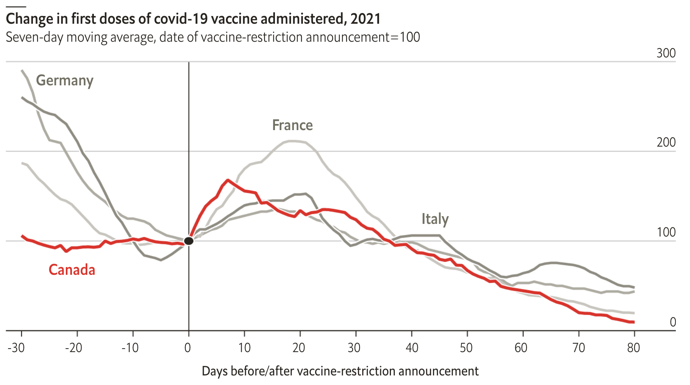

   Quelle: `Do vaccine mandates actually work?
   <https://www.economist.com/graphic-detail/2022/01/22/do-vaccine-mandates-actually-work>`_

.. _colour-hierarchy:

Mit Farbe kann auch eine visuelle Hierarchie hergestellt werden. Dies wird
:abbr:`z.B. (zum Beispiel)` in Material Design 3 verwendet, wobei die Höhe als
der Abstand zwischen den Komponenten entlang der z-Achse in `dichteunabhängigen
Pixeln (dps)
<https://m2.material.io/design/layout/pixel-density.html#density-independence>`_
gemessen wird:

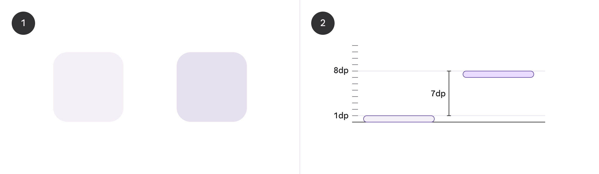

   Quelle: `Elevation
   <https://m3.material.io/styles/elevation/applying-elevation>`_

Farbpaletten
------------

Die Farbpalette für Datenvisualisierungen ist eine ausgewählte Teilmenge der
cusy-Design-Farbpalette. Sie wurde entwickelt, um die Zugänglichkeit und
Harmonie innerhalb einer Seite zu verbessern.

Kategorien
~~~~~~~~~~

Kategoriale (oder qualitative) Paletten eignen sich am besten, wenn sie diskrete
Datenkategorien unterscheiden sollen, die keine inhärente Korrelation aufweisen.

Kategoriale Farbpaletten werden hauptsächlich in folgenden Graphen und
Visualisierungsarten eingesetzt:

* Balkendiagramme:

  * Zur Unterscheidung verschiedener Kategorien oder Gruppen
  * Jede Kategorie erhält eine eigene Farbe

* Kreisdiagramme (Tortendiagramme):

  * Zur Darstellung von Anteilen verschiedener Kategorien
  * Jeder Sektor repräsentiert eine Kategorie mit einer eindeutigen Farbe

* Gruppierte Säulendiagramme:

  * Zur Veranschaulichung mehrerer Kategorien innerhalb von Hauptgruppen
  * Jede Unterkategorie wird durch eine eigene Farbe dargestellt

Die Farben dieser Palette sollten nacheinander genau wie unten beschrieben
angewendet werden. Die Sequenz wird sorgfältig kuratiert, um den Kontrast
zwischen benachbarten Farben zu maximieren und die visuelle Unterscheidung zu
erleichtern.
Die cusy Palette sollte nur für Daten und Darstellungen verwendet werden,
die den Werten von cusy entsprechen.

.. raw:: html
    :file: categorical-colors.html

Farbdifferenzen nach CIEDE2000
------------------------------

.. raw:: html
    :file: chord-ciede2000.html

Alternativen für das Light Theme
::::::::::::::::::::::::::::::::

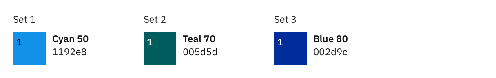

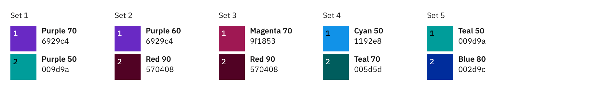

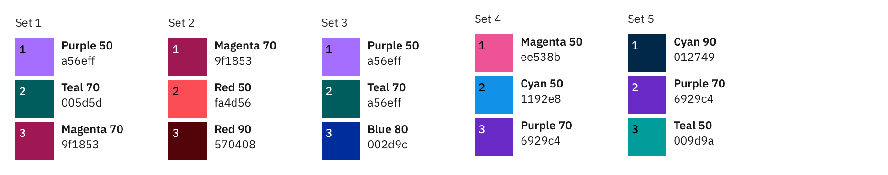

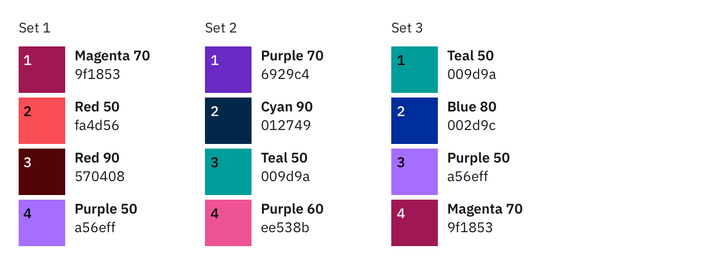

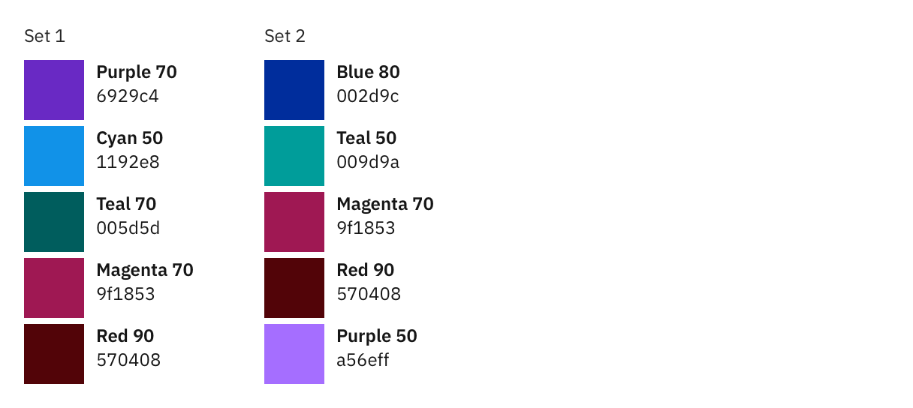

Alternativen für das Dark Theme
:::::::::::::::::::::::::::::::

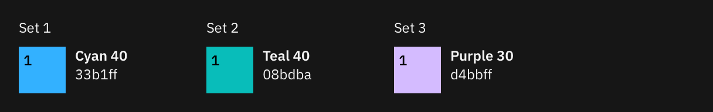

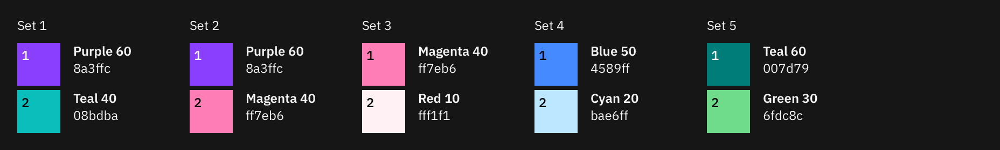

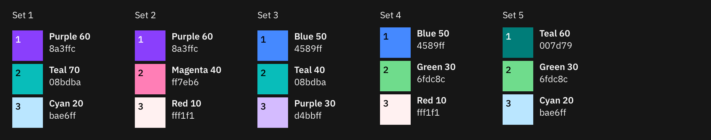

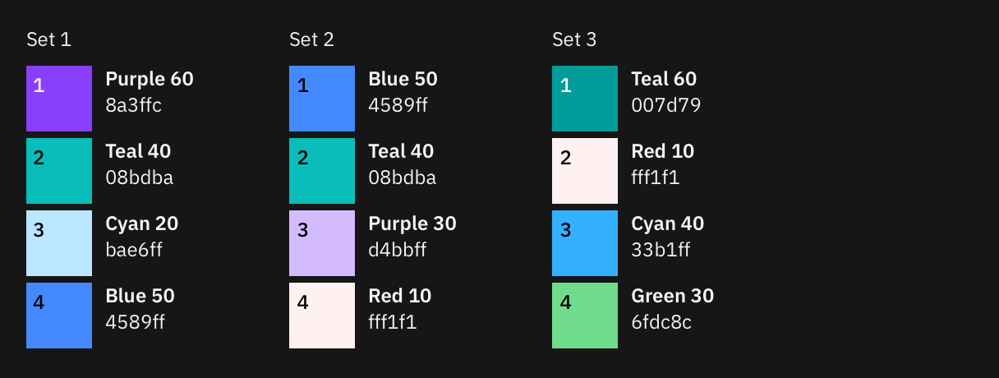

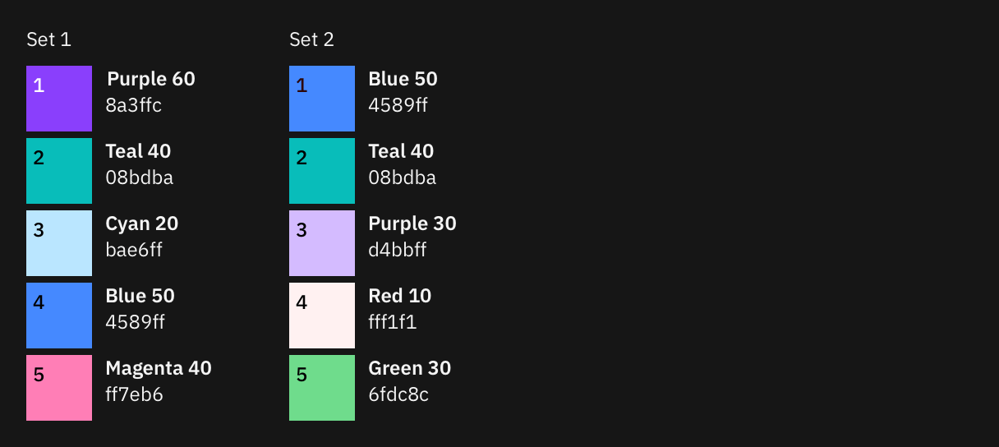

Sequenzen
---------

Einfarbig
~~~~~~~~~

Monochromatische Paletten eignen sich gut für Beziehungs- und Trenddiagramme.
Beim hellen Theme bezeichnet die dunkelste Farbe die größten Werte. In dunklen
Themes bezeichnet die hellste Farbe die größten Werte.

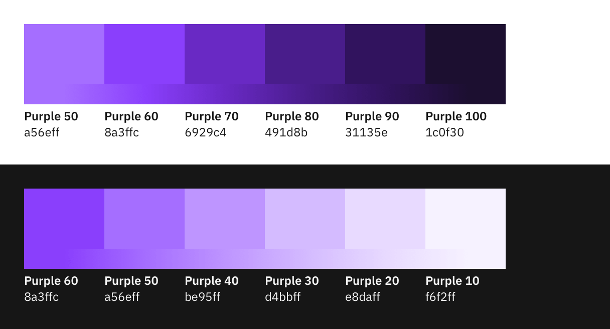
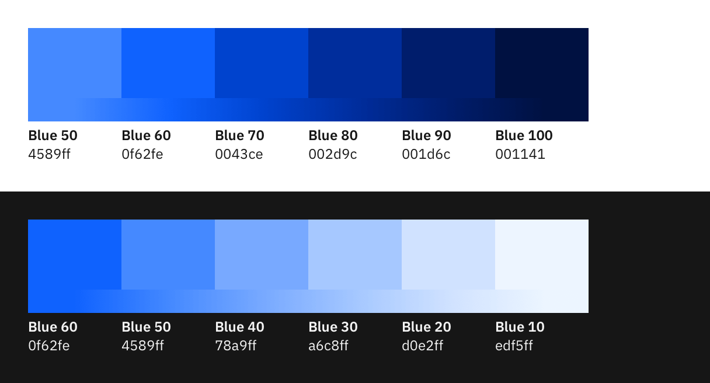

Warm-Kalt
~~~~~~~~~

Die Rot-Cyan-Palette hat einen natürlichen Zusammenhang mit der Temperatur.
Verwendet diese Palette für Daten, die heiß-vs-kalt darstellen sollen.

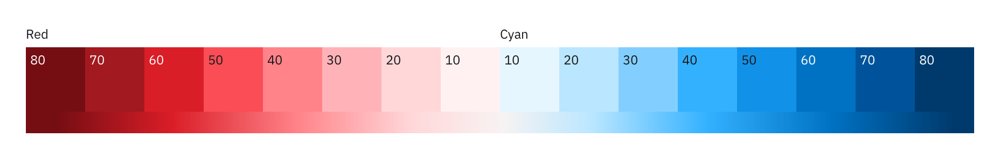

Verläufe ohne Farbassoziationen
~~~~~~~~~~~~~~~~~~~~~~~~~~~~~~~

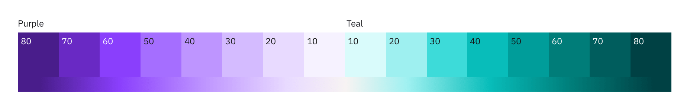

Alarm
~~~~~

Warnfarben werden verwendet, um den Status wiederzugeben. In der Regel steht Rot
für Gefahr oder Fehler. Orange ist eine ernsthafte Warnung. Gelb steht für eine
einfache Warnung und Grün für Normal oder Erfolg.

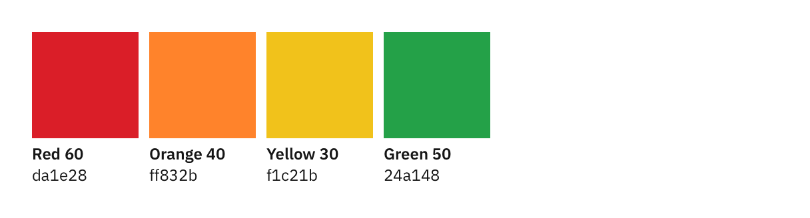

Farbverlauf
~~~~~~~~~~~

Farbverläufe eignen sich gut zum Hervorheben von Extremen in einem Wertebereich.
Verwendet einen Verlauf nur bei Bedarf für Visualisierungen separater
Kategorien. Mehrere Farbverläufe sind oft nicht zugänglich und nur selten
empfehlenswert. Farbverläufe sollten nicht verwendet werden, um eine Progression
oder Divergenz darzustellen.

.. note::
   Verwendet niemals einen Farbverlauf anstelle einer sequentiellen Palette.

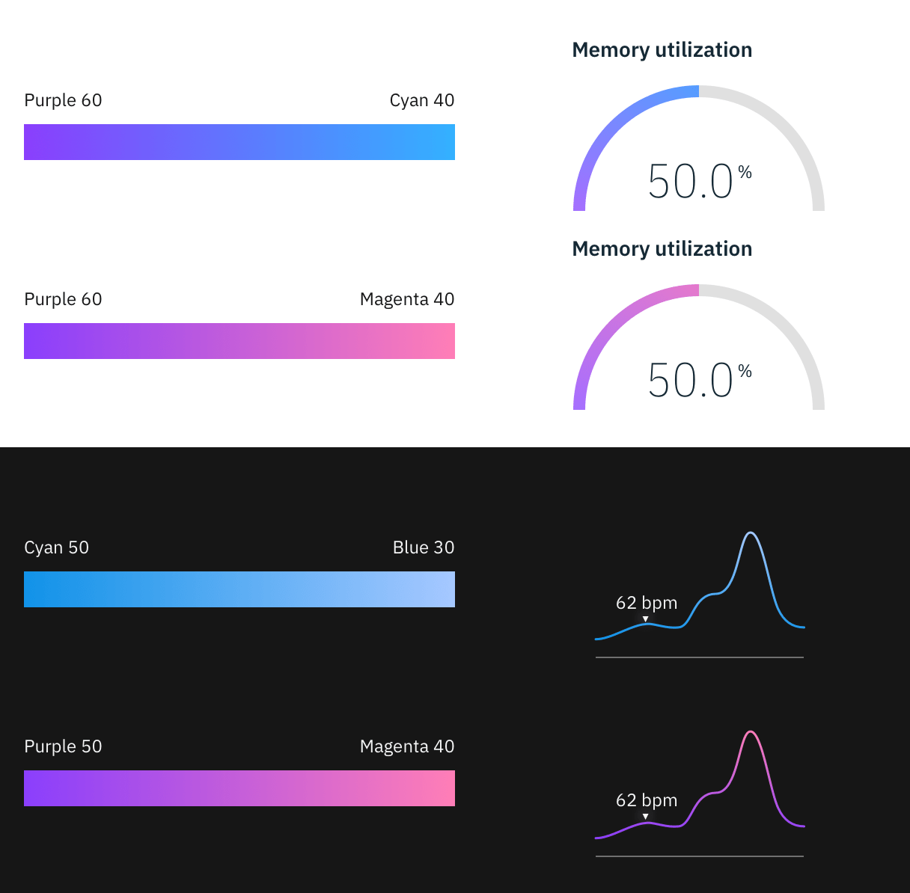

.. seealso::
   * `Paul Tol <https://sronpersonalpages.nl/~pault/>`_
   * `bokeh Accessible Palettes
     <https://docs.bokeh.org/en/latest/docs/reference/palettes.html#accessible-palettes>`_
