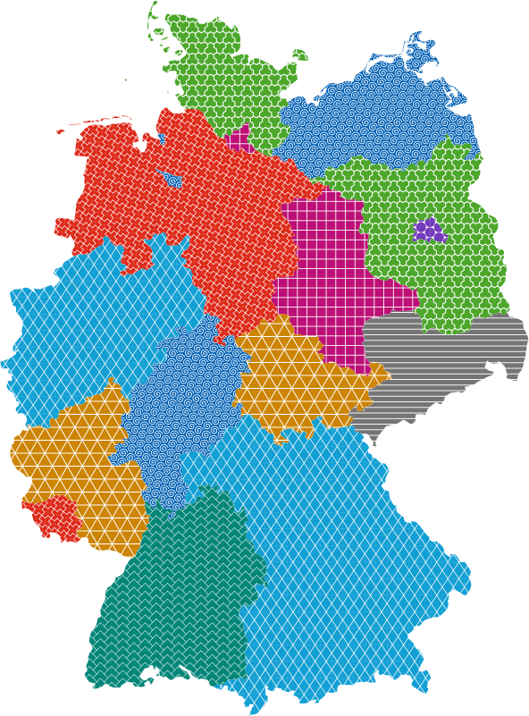
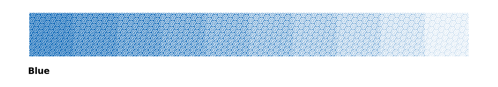
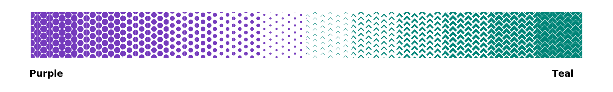
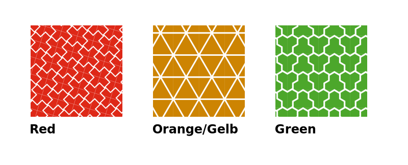

Farbe und Textur
================

Farbe
-----

Farbe ist ein starker Gestaltungsmechanismus zur Schaffung einer visuellen
Hierarchie. Sie kann signalisieren, welches die wichtigsten Elemente in einer
Datenvisualisierung sind. Ein gängiges Muster ist die Verwendung

#. auffälliger Farben zur Hervorhebung und Kennzeichnung der Daten oder
   Kategorien, die für die Aussage des Diagramms von größter Bedeutung sind
#. dezenterer Farben für sekundäre Daten oder Kategorien
#. von Schwarz für die wichtigsten Textelemente, wie den Titel der
   Visualisierung
#. von Grau

   * für weniger wichtige Daten, die nur für den Kontext hinzugefügt werden
   * für unterstützende Diagrammelemente, wie Achsenbeschriftungen und
     Gitterlinien

   Quelle: `TIOBE <https://www.tiobe.com/tiobe-index#container>`_

.. seealso::
   * `Paul Tol <https://sronpersonalpages.nl/~pault/>`_

.. _colour-hierarchy:

Mit Farbe kann auch eine visuelle Hierarchie hergestellt werden. Dies wird
:abbr:`z. B. (zum Beispiel)` in `Material Design 3 <https://m3.material.io>`_
verwendet, wobei die Höhe als der Abstand zwischen den Komponenten entlang der
z-Achse in `dichteunabhängigen Pixeln (dps)
<https://m2.material.io/design/layout/pixel-density.html#density-independence>`_
gemessen wird:

   Quelle: `Elevation
   <https://m3.material.io/styles/elevation/applying-elevation>`_

Farbpaletten
~~~~~~~~~~~~

Die Farbpalette für Datenvisualisierungen ist eine ausgewählte Teilmenge der
cusy-Design-Farbpalette. Sie wurde entwickelt, um die Zugänglichkeit und
Harmonie innerhalb einer Seite zu verbessern.

.. seealso::
   * `bokeh Accessible Palettes
     <https://docs.bokeh.org/en/latest/docs/reference/palettes.html#accessible-palettes>`_

Kategorien
::::::::::

Kategoriale (oder qualitative) Paletten eignen sich am besten, wenn sie diskrete
Daten unterscheiden sollen, die keine inhärente Korrelation aufweisen.

Kategoriale Farbpaletten werden hauptsächlich in folgenden Graphen und
Visualisierungsarten eingesetzt:

* Balkendiagramme:

  * Zur Unterscheidung verschiedener Kategorien oder Gruppen
  * Jede Kategorie erhält eine eigene Farbe

* Kreisdiagramme (Tortendiagramme):

  * Zur Darstellung von Anteilen verschiedener Kategorien
  * Jeder Sektor repräsentiert eine Kategorie mit einer eindeutigen Farbe

* Gruppierte Säulendiagramme:

  * Zur Veranschaulichung mehrerer Kategorien innerhalb von Hauptgruppen
  * Jede Unterkategorie wird durch eine eigene Farbe dargestellt

Die Farben dieser Palette sollten nacheinander genau wie unten beschrieben
angewendet werden. Die Sequenz wird sorgfältig kuratiert, um den Kontrast
zwischen benachbarten Farben zu maximieren und die visuelle Unterscheidung zu
erleichtern. Dabei sollte die cusy-Palette nur für Daten und Darstellungen
verwendet werden, die den Werten von cusy entsprechen.

.. raw:: html
   :file: categorical-colours.html

Sets
::::

.. raw:: html
   :file: sets.svg

Farbdifferenzen nach CIEDE2000
..............................

.. raw:: html
   :file: chord-ciede2000.html

.. csv-table::
   :file: ciede2000.csv
   :align: center

Textur
------

Um größtmögliche Zugänglichkeit zu erreichen und Farbenblinde zu unterstützen
empfehlen wir die Verwendung von mehreren Faktoren.

.. seealso::

   * `No use of color alone
     <https://observablehq.com/@frankelavsky/no-use-of-color-alone-in-data-visualization>`_

Wir verwenden folgende Formen:

In flächigen Diagrammen, wie Balken- und Kreisdiagrammen, können die Formen zu
annähernd flächendeckenden Texturen angeordnet werden:

Sequenzen
~~~~~~~~~

Einfarbig
:::::::::

Monochromatische Paletten eignen sich gut für Beziehungs- und Trend-Diagramme.
Hier empfehlen wir für Zugänglichkeit die Anpassung der Größe, :abbr:`bzw.
(beziehungsweise)` Strichstärke der Formen.

Warm-Kalt
:::::::::

Die Rot-Cyan-Palette lässt sich leicht mit unterschiedlichen Temperaturen
assoziieren. Verwendet daher diese Palette für Daten, die warm-kalt-Übergänge
darstellen sollen.

Verläufe ohne Farbassoziationen
:::::::::::::::::::::::::::::::

SVG-Muster-Generator
::::::::::::::::::::

.. raw:: html
   :file: svg-pattern-generator.html

Ampel
:::::

Die Ampel-Metapher kann verwendet werden, um den Status wiederzugeben. In der
Regel steht Rot für Stop oder Gefahr, Orange/Gelb für Vorsicht oder Übergang und
Grün für Losgehen oder Erfolg.

.. Code für Buttons zum Wechseln des Themas:
.. raw:: html
   :file: theme-toggle.html

.. toctree::
    :hidden:
    :titlesonly:
    :maxdepth: 0

    bokeh-example.ipynb
    altair-example.ipynb
    leaflet-example.ipynb
