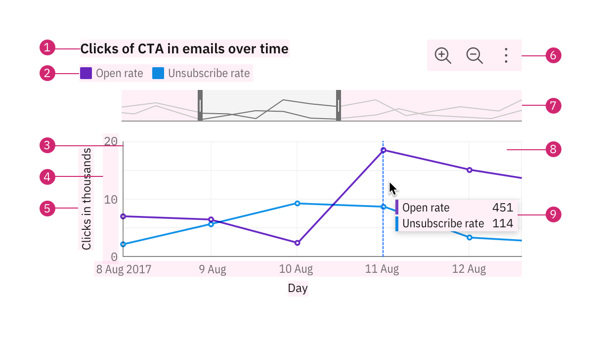
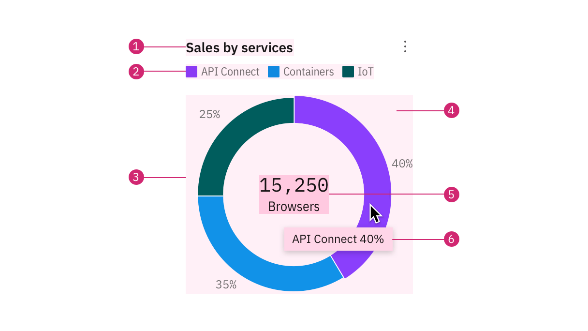

Aufbau eines Diagramms
======================

Es gibt viele unterschiedliche :doc:`../types/index` für Datenvisualisierungen.
Die meisten Diagramme haben jedoch viele Elemente gemeinsam. Die richtige
Anordnung dieser Elemente kann das Design eurer Visualisierung unterstützen.

Die Elemente, aus denen jedes Diagramm besteht, sollten so konzipiert sein, dass
sie harmonisch funktionieren. Jedes Teil spielt eine wichtige Rolle in der
Datenkommunikation.

Rechteckige Diagramme
---------------------

Die meisten Datenvisualisierungen sind rechteckige Diagramme mit zwei
Dimensionen, die auf einer vertikalen und einer horizontalen Achse dargestellt
werden. Rechteckige Diagramme werden normalerweise mit einer Reihe gemeinsamer
Elemente erstellt, darunter eine Legende, Achsentitel und Navigationswerkzeuge
wie eine Zoomleiste und ein Tooltip.

#. Diagrammtitel
#. Legenden
#. Achsen
#. Maßstab
#. Achsentitel
#. Symbolleiste
#. Zoomleiste
#. Diagrammrahmen
#. Tooltip

Diagrammtitel
    Der Titel einer Visualisierung sollte präzise und beschreibend sein und die
    Erkenntnisse widerspiegeln, die die Daten liefern.

Legende
    Viele Diagramme verwenden unterschiedliche visuelle Eigenschaften wie
    Farben, Texturen und Formen, um unterschiedliche Kategorien oder Dimensionen
    von Daten darzustellen. Eine Legende sagt, was diese Assoziationen bedeuten,
    und hilft, die Bedeutung des Diagramms zu bestimmen. Weitere Informationen
    findet ihr in :doc:`legends`.

Achsen
    Wenn ein Diagramm `kartesische Koordinaten
    <https://de.wikipedia.org/wiki/Kartesisches_Koordinatensystem>`_ verwendet,
    ist die x-Achse die horizontale und die y-Achse die vertikale Achse.
    Auch eine :ref:`z-axis` lässt sich simulieren. Weitere Informationen findet
    ihr in :doc:`axes-and-labels`.

Tooltip
    Ein Tooltip ist eine Meldung, die angezeigt wird, wenn sich ein Cursor über
    einem Element befindet, :abbr:`z.B. (zum Beispiel)` über einem Datenpunkt
    oder über einer Schaltfläche. Standardmäßig werden Tooltips bei ``hover``
    angezeigt, um detailliertere Informationen oder den Kontext für bestimmte
    Diagrammelemente anzuzeigen. Ein Tooltip sollte die entsprechenden Werte des
    Datenpunkts auf beiden Achsen wiederholen und weitere relevante Details
    anzeigen.

Grafikrahmen
    Der Grafikrahmen ist der Bereich, in dem Daten mit Grafiken visualisiert
    werden. Gitterlinien helfen dem Betrachter, die Werte eines Datenpunkts zu
    schätzen, sind jedoch nicht unbedingt erforderlich.

    .. note::
        Verwendet Gitterlinien sparsam, da zu viel visuelles Rauschen die
        Fähigkeit des Betrachters zur Interpretation der Daten negativ
        beeinflusst.

Kreisdiagramme
--------------

#. Diagrammtitel
#. Legenden
#. Etikett
#. Diagrammrahmen
#. Leistungskennzahl
#. Tooltip

Etikett
    Es liefert den prozentualen Wert für eine einzelne Kategorie.

Leistungskennzahl
   Er besteht aus einer Zahl mit einer einzelnen Wortbeschreibung. Beispiele
   hierfür sind *15,250 Browser*, *1,3 Millionen US-Dollar Umsatz* oder
   *Insgesamt 450*. Sie kann innerhalb eines Ringdiagramms verwendet
   werden, um eine Gesamtsumme oder die individuelle Anzahl eines Teils bei
   Interaktion anzuzeigen. Dieses Element kann auch unabhängig in
   :doc:`../dashboards` verwendet werden.

.. toctree::
    :hidden:
    :titlesonly:
    :maxdepth: 0

    axes-and-labels
    legends
    aspect-ratios
    colors
