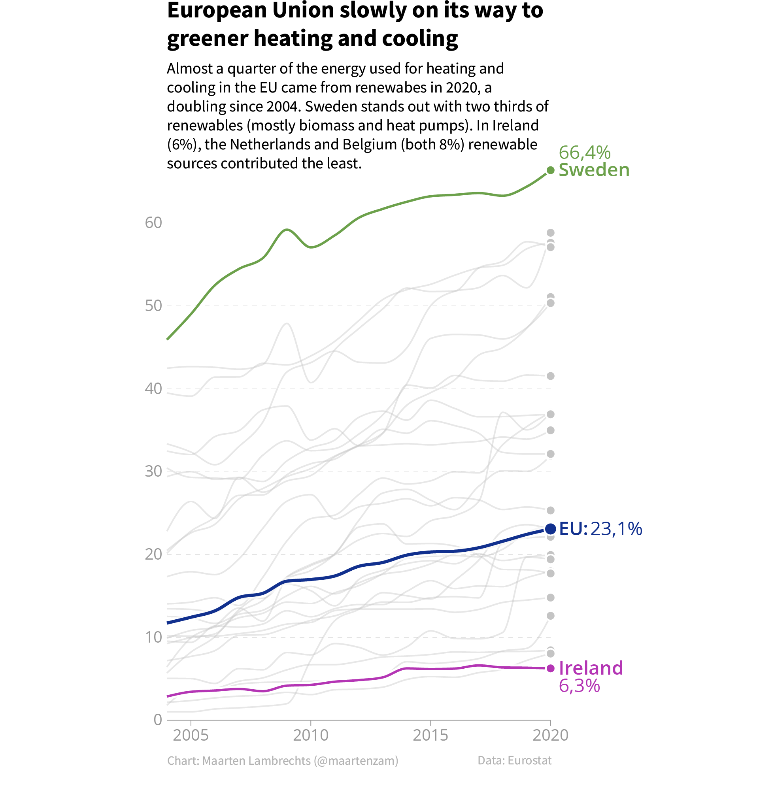

Gliederung und Leserichtung
===========================

In Sprachen, die von links nach rechts gelesen werden, beginnt die Betrachtung
in der Regel in der linken oberen Ecke einer Seite und endet in der rechten
unteren Ecke.

Dies hat Auswirkungen darauf, wie die Elemente auf der Seite angeordnet werden
sollten: Das wichtigste Element auf der Seite sollte zuerst betrachtet werden.
Daher sollte dieses Element in der linken oberen Ecke stehen. In vielen Fällen
wird dies der Titel sein.

         greener heating and cooling». Das Diagramm enthält eine Linie für
         jeden EU-Mitgliedstaat, und die Linien für Schweden, die EU und Irland
         sind farblich hervorgehoben und beschriftet.

.. warning::
   Visualisierungen ziehen die Aufmerksamkeit auf sich und können damit die
   Lesereihenfolge unterbrechen. So könnte direkt zur Visualisierung gesprungen
   werden, ohne die vorangehenden Inhalt zu beachten.

   .. figure:: size-overruling-hierarchy.png
      :alt: Eine Karte mit der Landnutzung in den USA. Der Titel ist rechts und
            lautet «How America Uses Its Land».

   Daher sollten Visualisierungen so eigenständig wie möglich sein und alle
   Informationen enthalten, die für eine korrekte Interpretation erforderlich
   sind.

Wenn mehrere Visualisierungen in eine Seite eingebettet sind, sollte die
Lesereihenfolge bei der Anordnung der Visualisierungen berücksichtigt werden.
Achtet darauf, dass die Reihenfolge der Visualisierungen und des Inhalts
dazwischen der Lesereihenfolge folgt, um einen logischen Fluss zu schaffen. Dies
ist besonders wichtig bei der Gestaltung von :doc:`dashboards`.
