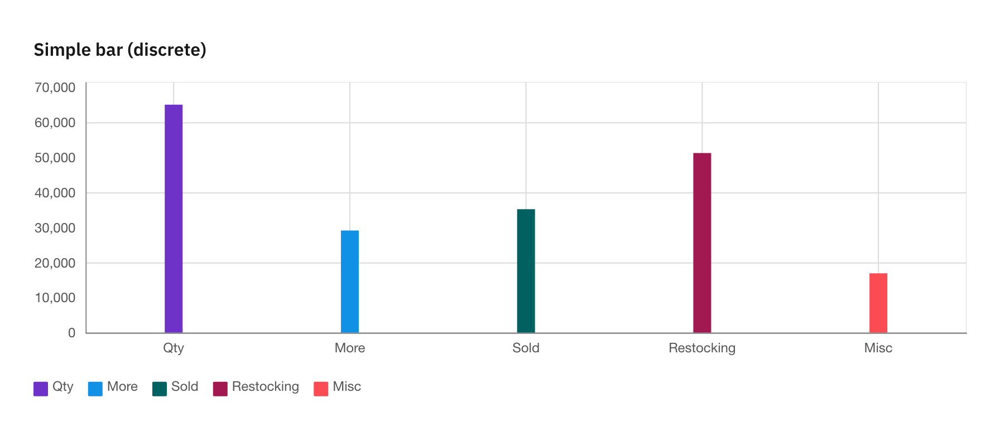
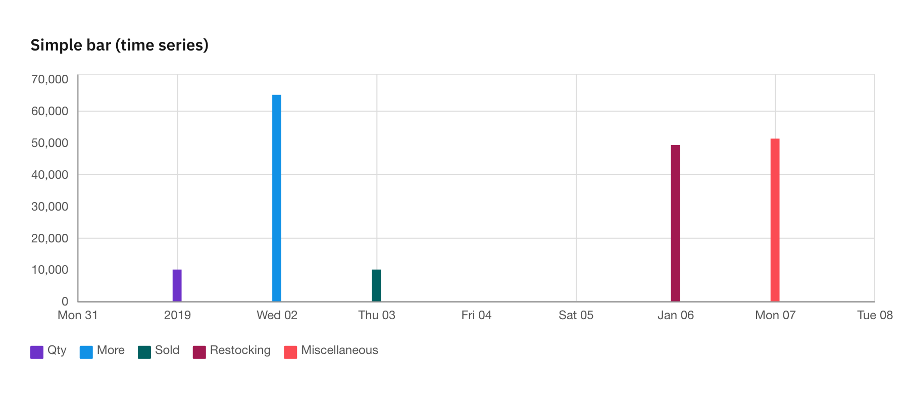
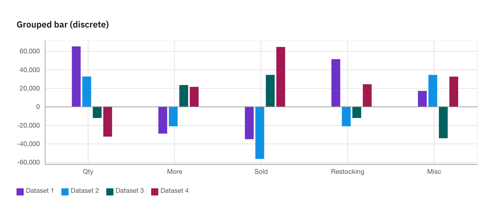
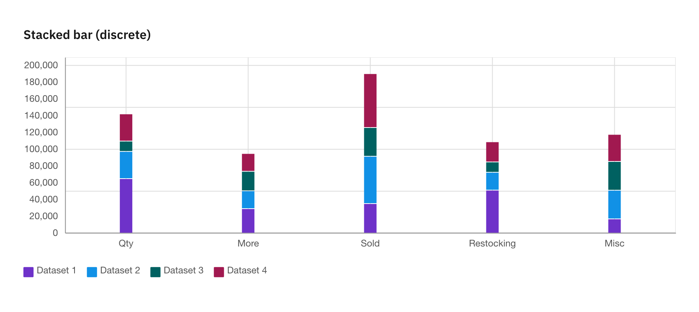
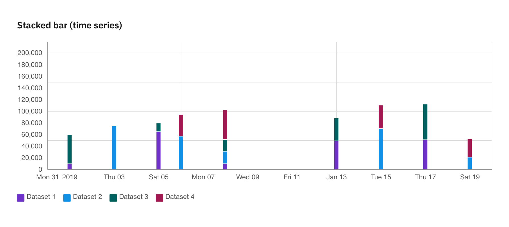
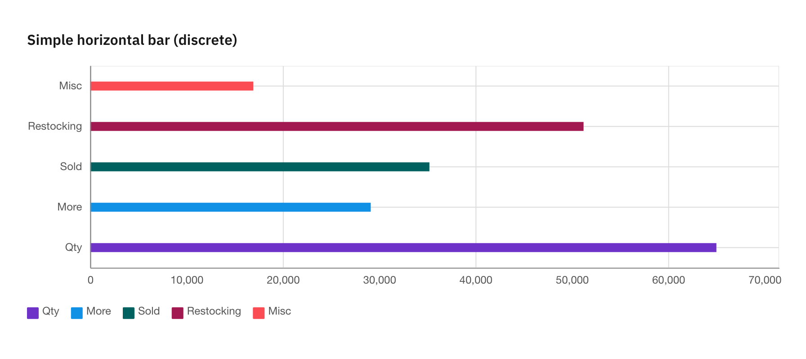
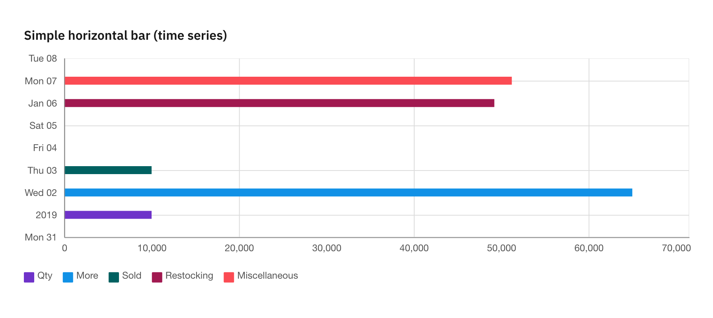
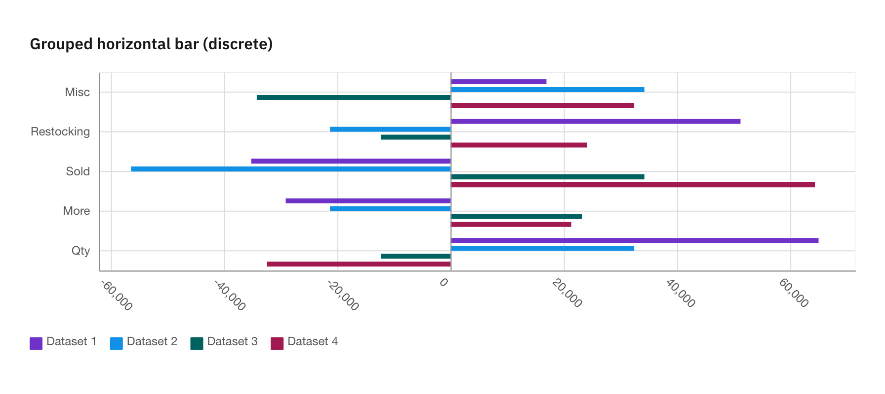
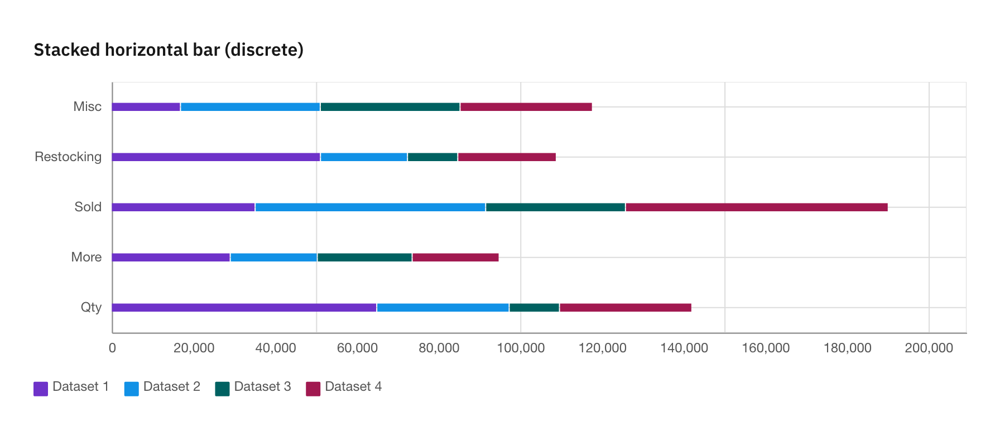

Balkendiagramme
===============

Balkendiagramme verwenden vertikale oder horizontale Datenmarkierungen, um
einzelne Werte zu vergleichen. Sie können verwendet werden, um diskrete Daten zu
vergleichen oder Trends im Zeitverlauf anzuzeigen.

.. _grouped-bar-charts:

Gruppierte Balkendiagramme
--------------------------

Ein gruppiertes Balkendiagramm mit mehreren Sätzen erlaubt Werte über mehrere
Kategorien hinweg zu vergleichen.

.. _stacked-bar:

Gestapelte Balkendiagramme
--------------------------

Gestapelte Balkendiagramme sind nützlich, um proportionale Beiträge innerhalb
einer Kategorie zu vergleichen. Sie zeigen den relativen Wert aller Datenreihen
zur Gesamtsumme.

.. _horizontal-bar-charts:

Horizontale Balkendiagramme
---------------------------

Balkendiagramme verwenden vertikale oder horizontale Datenmarkierungen, um
einzelne Werte zu vergleichen. Sie können verwendet werden, um diskrete Daten zu
vergleichen oder Trends im Zeitverlauf anzuzeigen.

   Ein gruppiertes Balkendiagramm ist eine Balkendiagramm, mit dem Werte über
   mehrere Kategorien hinweg verglichen werden können.

