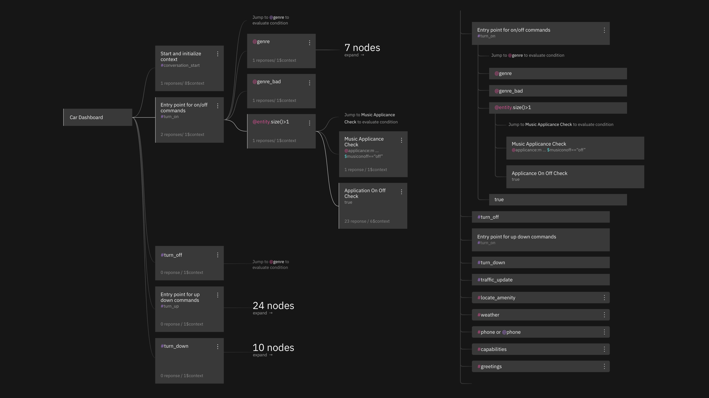
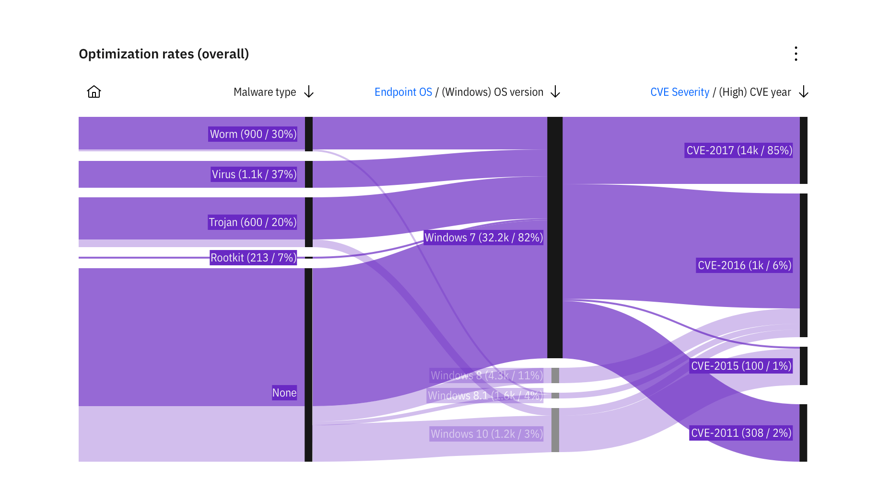

Graphen und Flussdiagramme
==========================

Graphen
-------

.. _tree-diagram:

Baumdiagramme
~~~~~~~~~~~~~

Ein Baumdiagramm, auch Stemma genannt, ist eine graphische Darstellung, welche
hierarchische Abhängigkeiten durch Verbindungslinien darstellt. Mögliche
Anwendungsfälle sind :abbr:`z.B. (zum Beispiel)` Stammbäume, Entscheidungsbäume
und Mindmaps.

   Baumdiagramm, Knotenansicht vs. Listenansicht

Flussdiagramme
--------------

Es gibt verschiedene Typen von Flussdiagrammen, :abbr:`z.B. (zum Beispiel)`

Alluviale Diagramme
    betont signifikante Veränderungen in Netzwerken und fasst sie ggf.
    zusammen.
Kontrollflussdiagramme
    zur Beschreibung von Regelkreisläufen
Kumulative Flussdiagramme
    werden :abbr:`z.B. (zum Beispiel)` in der `Queueing Theory
    <https://en.wikipedia.org/wiki/Queueing_theory>`_ verwendet.
Zustandsübergangsdiagramme
    zur grafischen Darstellung endlicher Automaten

.. _alluvial-diagram:

   Beispiel eines alluvialen Diagramms
