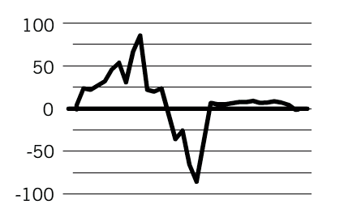

Diagrammtypen
=============

Die Wahl des besten Diagrammtyps für die Übermittlung eurer Daten ist nicht
einfach. Es gibt viele verschiedene Diagrammtypen, die alle unterschiedliche
Aspekte eurer Daten hervorheben. Bei der Auswahl eines Diagrammtyps geht es um viel mehr als nur darum, die Spalten in euren Daten zu betrachten. Bestimmt daher
zunächst den Zweck der Visualisierung und wählt dann den geeigneten Diagrammtyp.

.. seealso::
   * `Visual Vocabulary – Designing with data
     <https://ft-interactive.github.io/visual-vocabulary/>`_
   * `Financial-Times/chart-doctor//visual-vocabulary
     <https://github.com/Financial-Times/chart-doctor/tree/main/visual-vocabulary>`_
   * `The Data Visualisation Catalogue <https://datavizcatalogue.com/>`_

Datentypen
----------

Sie schränken die Optionen für die Diagrammtypen ein:

Kategorischen Daten
    sind in der Regel um textbasierte Daten gruppierter Datensätze.
Numerische Daten
    sind der häufigste Datentyp in der Datenvisualisierung. Zahlen können
    verwendet werden, um geometrische Objekte in einer Visualisierung auf der
    x- oder y-Achse zu positionieren, zu vergrößern oder zu färben.
Abgegrenzte numerische Werte
    verhalten sich sehr ähnlich wie kategorische Daten.
Zeitliche Daten
    werden in der Regel als Liniendiagramme dargestellt, wobei die X-Achse die
    Zeitachse ist und die Zeit von links nach rechts verläuft.
Geografische Daten
    sind alle Arten von Daten (kategorische, numerische oder zeitliche Daten
    oder eine Kombination davon), die zusätzlich Informationen über geografische
    Orte enthalten.

Botschaft
---------

Durch Filtern, Auswählen und Aggregieren können die Daten so umgewandelt werden,
dass sie in bestimmte Diagrammtypen passen:

* kontinuierliche numerische Daten können in eine diskrete Anzahl von Klassen
  eingeteilt werden.
* Geografischen Daten können entfernt oder ignoriert werden.
* Tägliche Daten können zu monatlichen Durchschnittswerten oder monatlichen
  Gesamtwerten aggregiert werden, je nachdem, welche Trends gezeigt werden
  sollen.

.. seealso::

   Galerien zur Datenvisualisierung:

   `Dataviz Project <https://datavizproject.com/>`_
       Sammlung von Datenvisualisierungen mit mehr als 160 Diagrammtypen.
   `Data to Viz <https://www.data-to-viz.com/>`_
       Etwa 40 Diagrammtypen, die in einem Entscheidungsbaum ermittelt werden
       können.
   `Dataviz Inspiration <https://www.dataviz-inspiration.com/>`_
       Sammlung von Datenvisualisierungen, die von Yan Holtz, einem der Autoren
       von data-to-viz.com kuratiert wurde um die schönsten und wirkungsvollsten
       Datenvisualisierungsprojekte vorzustellen.
   `Dataviz Catalogue <https://datavizcatalogue.com/>`_
       Rund 60 Diagrammtypen, die nach Funktionen durchsucht werden können.
   `Xenographics <https://xeno.graphics/>`_
       Sammlung seltsamer, aber (manchmal) nützlicher Diagramme, kuratiert von
       Maarten Lambrechts. Das Ziel der Sammlung ist es, neuartige, innovative
       und experimentelle Visualisierungen zu zeigen, die für die Visualisierung
       bestimmter Datensätze inspirierend sein können.
   `One chart at a time <https://www.youtube.com/watch?v=gFFj22kjlZk>`_
       Reihe von Videos, die der Buchautor, Podcaster und
       Visualisierungsspezialist Jon Schwabish erstellt hat. Für die Videoserie
       hat er mehr als 50 Personen aus der Welt der Datenvisualisierung gebeten,
       einen bestimmten Diagrammtyp zu diskutieren, indem sie ihn beschreiben
       und einige Beispiele für den Diagrammtyp geben.

Vergleiche
~~~~~~~~~~

.. grid:: 3

   .. grid-item-card:: Balkendiagramm

      .. image:: bar-discrete.png
         :alt: Diskretes Balkendiagramm
         :target: https://www.cusy.design/viz/types/bar-charts.html

   .. grid-item-card:: Gruppiertes Balkendiagramm

      .. image:: bar-grouped-discrete.png
         :alt: Gruppiertes Balkendiagramm
         :target: https://www.cusy.design/viz/types/bar-charts.html#grouped-bar-charts

   .. grid-item-card:: Horizontales Balkendiagramm

      .. image:: bar-horizontal-discrete.png
         :alt: Horizontales Balkendiagramm
         :target: https://www.cusy.design/viz/types/bar-charts.html#horizontal-bar-charts

   .. grid-item-card:: Blasendiagramm

      .. image:: bubble-chart.png
         :alt: Blasendiagramm
         :target: https://www.cusy.design/viz/types/scatter-bubble-charts.html#bubble-charts

Trends
~~~~~~

.. grid:: 3

   .. grid-item-card:: Liniendiagramm

      .. image:: line-chart-discrete.png
         :alt: Diskretes Balkendiagramm
         :target: https://www.cusy.design/viz/types/line-area-charts.html#line-charts

   .. grid-item-card:: Flächendiagramm

      .. image:: area-chart-discrete.png
         :alt: Flächendiagramm
         :target: https://www.cusy.design/viz/types/line-area-charts.html#area-charts

   .. grid-item-card:: Boxplot

      .. image:: boxplot.png
         :alt: Boxplot
         :target: https://www.cusy.design/viz/types/line-area-charts.html

Teil-zu-Ganzes
~~~~~~~~~~~~~~

.. grid:: 3

   .. grid-item-card:: Ringdiagramm

      .. image:: donut.png
         :alt: Ringdiagramm
         :target: https://www.cusy.design/viz/types/piecharts.html#donut

   .. grid-item-card:: Kreisdiagramm

      .. image:: pie.png
         :alt: Kreisdiagramm
         :target: https://www.cusy.design/viz/types/piecharts.html#pie

   .. grid-item-card:: Gestapeltes Balkendiagramm

      .. image:: bar-stacked-discrete.png
         :alt: Gestapeltes Balkendiagramm
         :target: https://www.cusy.design/viz/types/bar-charts.html#stacked-bar

   .. grid-item-card:: Gestapeltes Flächendiagramm

      .. image:: area-chart-discrete.png
         :alt: Gestapeltes Flächendiagramm
         :target: https://www.cusy.design/viz/types/line-area-charts.html#stacked-area

   .. grid-item-card:: Halbkreisförmiges Ringdiagramm

      .. image:: gauge-chart.png
         :alt: Halbkreisförmiges Ringdiagramm
         :target: https://www.cusy.design/viz/types/piecharts.html#gauge

   .. grid-item-card:: Tree Map

      .. image:: treemap.png
         :alt: Tree Map
         :target: https://www.cusy.design/viz/types/maps.html#tree-map

Korrelationen
~~~~~~~~~~~~~

.. grid:: 3

   .. grid-item-card:: Streudiagramm

      .. image:: scatter-discrete.png
         :alt: Streudiagramm
         :target: https://www.cusy.design/viz/types/scatter-bubble-charts.html#scatter

   .. grid-item-card:: Heatmap

      .. image:: heatmap.png
         :alt: Heatmap
         :target: https://www.cusy.design/viz/types/maps.html#heatmap

Verbindungen
~~~~~~~~~~~~

.. grid:: 3

   .. grid-item-card:: Alluvial-Diagramm

      .. image:: flowchart.png
         :alt: Alluvial-Diagramm
         :target: https://www.cusy.design/viz/types/graph-flowcharts.html#alluvial-diagram

   .. grid-item-card:: Baumdiagramm

      .. image:: treediagram.png
         :alt: Baumdiagramm
         :target: https://www.cusy.design/viz/types/graph-flowcharts.html#tree-diagram

Geodaten
~~~~~~~~

.. grid:: 3

   .. grid-item-card:: Choroplethenkarte

      .. image:: map-choropleth.png
         :alt: Choroplethenkarte
         :target: https://www.cusy.design/viz/types/maps.html#choropleth

   .. grid-item-card:: Symbole für Proportionen

      .. image:: map-proportion.png
         :alt: Symbole für Proportionen
         :target: https://www.cusy.design/viz/types/maps.html#proportional-symbol

   .. grid-item-card:: Verbindungskarte

      .. image:: map-connecting.png
         :alt: Verbindungskarte
         :target: https://www.cusy.design/viz/types/maps.html#verbindungskarten

Datengröße
----------

Wenn ihr beispielsweise die Lebenserwartung aller Länder darstellen möchtet,
eignet sich ein Balkendiagramm nicht besonders gut. Stattdessen könnt ihr ein
**Punktdiagramm** verwenden – es erfasst die Daten in weniger Pixeln, also mit
einer höheren Datendichte.

Ein Nachteil dieser Art von Diagrammen ist jedoch, dass sie
Interaktivität erfordern, um jedes Land zu identifizieren, da zu wenig Platz zur
Verfügung steht, um alle Ländernamen in der Visualisierung unterzubringen.

**Streudiagramme** sind ebenfalls eine Visualisierungsart mit hoher Datendichte:
Die Darstellung von tausenden Datensätzen ist jedoch auch hier ein Problem, da
die Punkte sich dann überlappen.

.. figure:: datashader.png
   :alt: Datashader

   Quelle: PyViz-Tutorial: `Datashader
   <https://pyviz-tutorial.readthedocs.io/de/latest/bokeh/integration/datashader.html#datashader>`_

Das folgende **Horizon-Chart** zeigt mehr als 70 Zeitreihen in einem einzigen
Diagramm.

.. figure:: horizon-chart-ruys.png
   :alt: Horizon-Chart

   Quelle: `vizualism.nl
   <https://www.vizualism.nl/winnaar-infographicjaarprijs-2009/>`_

.. seealso::
   * `UW Interactive Data Lab: Sizing the Horizon
     <https://idl.uw.edu/papers/horizon>`_
   * `Vega-Altair <https://altair-viz.github.io/gallery/horizon_graph.html>`_

Zielgruppe
----------

Auch das Zielpublikum eurer Visualisierung spielt eine wichtige Rolle bei der
Wahl des Diagrammtyps. In erster Linie müsst ihr berücksichtigen, wie vertraut
euer Publikum mit den Daten ist. Es kann von den Informationen, die ihr ihm
zeigt, überwältigt sein, wenn ihr unbekannte Daten in Kombination mit einem
unbekannten oder komplexen Diagramm präsentiert. Daher ist es am besten,
komplexe und innovativere Diagrammtypen nur mit Daten zu verwenden, mit denen
eure Zielgruppe vertraut ist. Einige Wissensgebiete haben eine lange Tradition
bei der Verwendung komplexerer Datenvisualisierungen für bestimmte Daten. Ein
Beispiel war das Candlestick-Chart:

.. figure:: datavizcatalogue-candlestick.svg
   :alt: Candlestick-Chart

   Quelle: `Frankfurt vies for UK banking jobs post-Brexit
   <https://www.ft.com/content/3f3ce35e-8c9b-11e6-8aa5-f79f5696c731>`_

Medium
------

Das Medium, in dem eine Visualisierung veröffentlicht wird, hat ebenfalls einen
Einfluss darauf, welcher Diagrammtyp optimal ist. Die offensichtlichste
Eigenschaft eines Mediums sind die Dimensionen, die es für eine Visualisierung
bieten kann. Viele Visualisierungen werden heute nicht mehr gedruckt, sondern
können interaktiv betrachtet werden.

.. raw:: html

   <iframe title="Where the population of Europe is growing, and where it’s declining " aria-label="Map" id="datawrapper-chart-iUPVd" src="https://datawrapper.dwcdn.net/iUPVd/5/" scrolling="no" frameborder="0" style="width: 0; min-width: 100% !important; border: none;" height="585"></iframe>

.. toctree::
   :hidden:
   :titlesonly:
   :maxdepth: 0

   bar-charts
   line-area-charts
   piecharts
   scatter-bubble-charts
   graph-flowcharts
   maps
