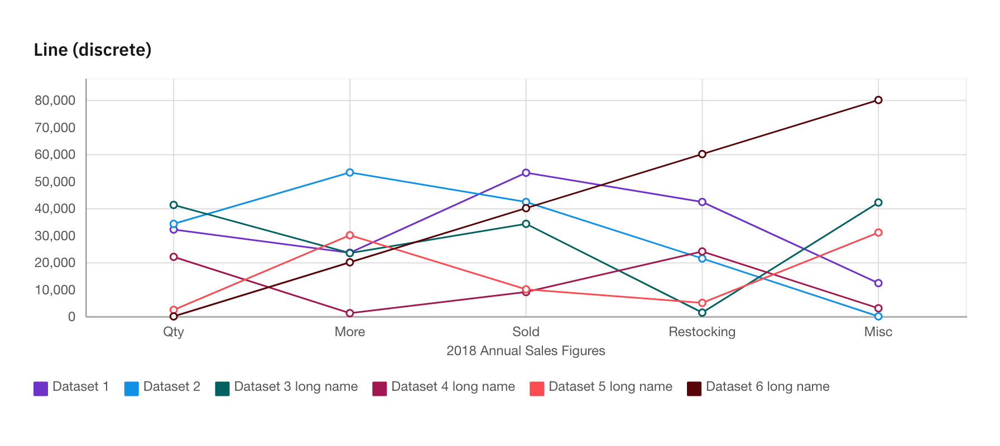
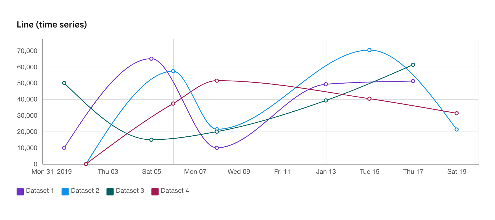
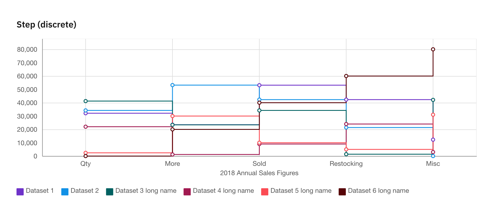
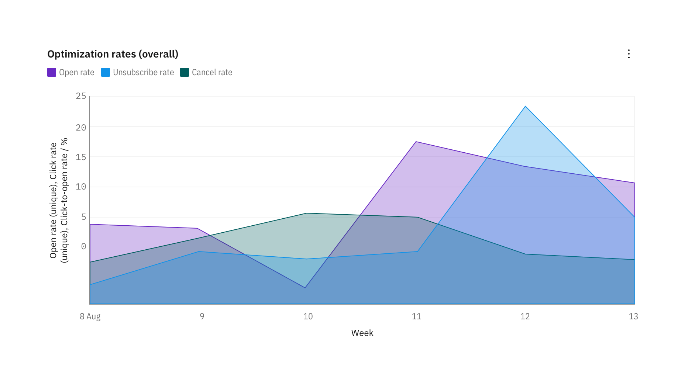
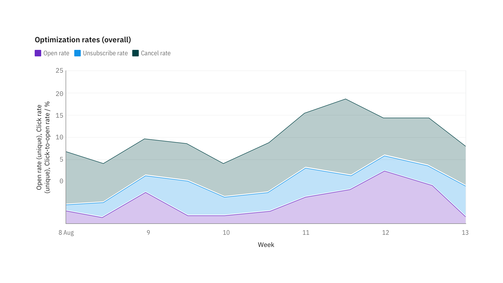

Linien- und Flächendiagramme
============================

Liniendiagramme
---------------

Liniendiagramme zeichnen Daten in regelmäßigen Abständen, die durch Linien
verbunden sind. Mithilfe von Liniendiagrammen könnt ihr Trends im Zeitverlauf
anzeigen und mehrere Datensätze vergleichen.

Flächendiagramme
----------------

Flächendiagramme ähneln Liniendiagrammen, aber die Bereiche unter den Linien
sind mit Farben oder Mustern gefüllt.

Gestapelte Flächendiagramm
--------------------------

Gestapelte Flächendiagramme sind nützlich, um proportionale Beiträge innerhalb
einer Kategorie zu vergleichen. Sie zeichnen den relativen Wert auf, den jede
Datenreihe zur Gesamtsumme beiträgt.

