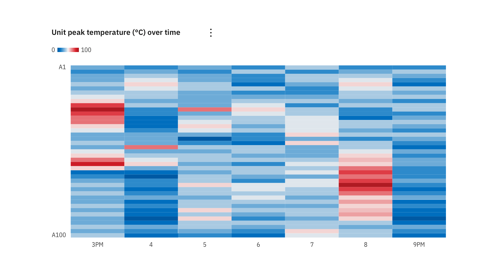
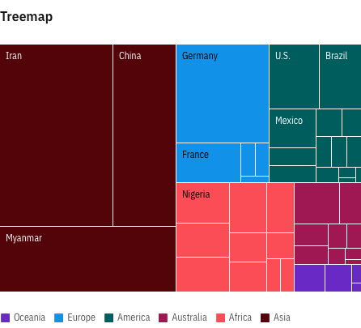
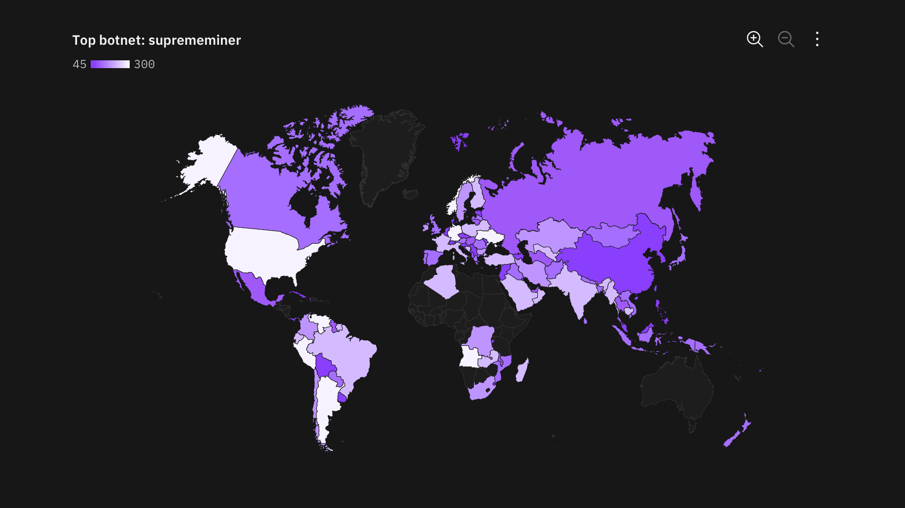
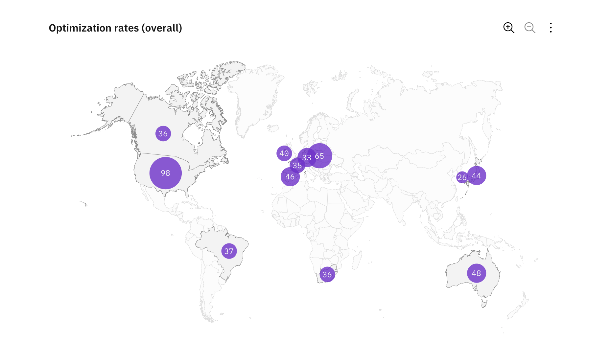
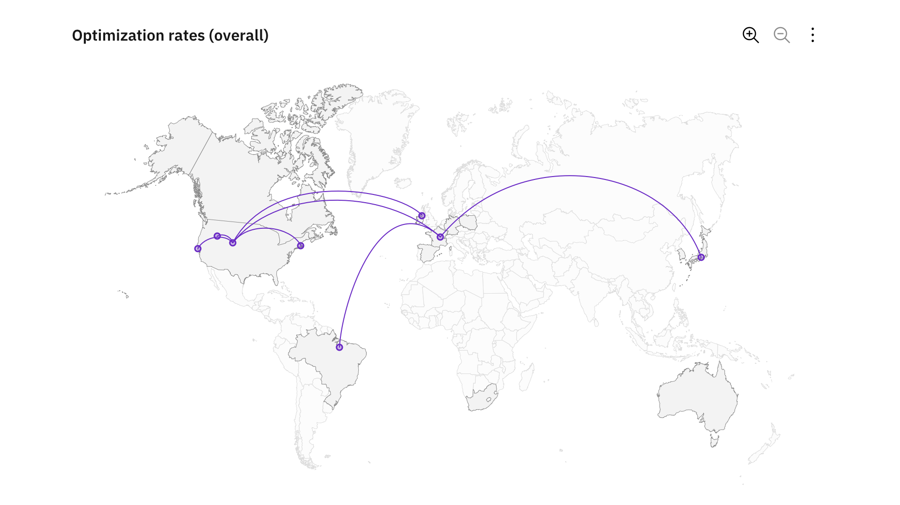

Karten
======

.. _heatmap:

Heatmaps
--------

Eine Heatmap oder Wärmekarte ist eine grafische Darstellung von Daten, bei der
einzelne in einer Matrix enthaltene Werte als Farben dargestellt werden.

.. _tree-map:

Tree Maps
---------

Eine Tree Map oder ein Kacheldiagramm dient der Visualisierung hierarchischer
Strukturen mit ineinander verschachtelten Rechtecken. Damit können anschaulich
Größenverhältnisse dargestellt werden, indem die Fläche der Rechtecke
proportional zur Datenmenge dargestellt wird.

Geographische Karten mit Überlagerungen
---------------------------------------

.. _choropleth:

Choroplethenkarten
~~~~~~~~~~~~~~~~~~

Eine Choroplethenkarte verwendet Unterschiede in Schattierung, Färbung oder
Platzierung von Symbolen in vordefinierten Bereichen, um die Durchschnittswerte
einer Eigenschaft oder Menge in diesen Bereichen anzugeben.

   Beispiel einer Choroplethenkarte

.. _proportional-symbol:

Symbole für Proportionen
~~~~~~~~~~~~~~~~~~~~~~~~

Geographische Regionen werden von, durch Daten gesteuerten Symbolen für
Proportionen überlagert. Ein häufig verwendetes Symbol ist eine Blase, deren
Kreisfläche proportional zu ihrem Wert im Datensatz ist.

   Beispiel eines proportionalen Symbols

.. _connecting-lines:

Verbindungskarten
~~~~~~~~~~~~~~~~~

Verbindungskarten zeigen Punkte auf einer Karte an, die durch gerade oder
gekrümmte Linien verbunden sind.

Verbindungszuordnungen sind am nützlichsten, wenn Verbindungen und Beziehungen
geografisch angezeigt werden. Sie können auch verwendet werden, um Kartenrouten
über eine einzelne Kette von Gliedern anzuzeigen. Auch räumliche Muster lassen
sich durch die Verteilung von Verbindungen oder durch die Konzentration von
Verbindungen verdeutlichen.

   Beispiel einer Karte mit Verbindungslinien
