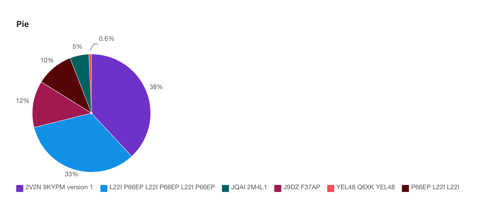
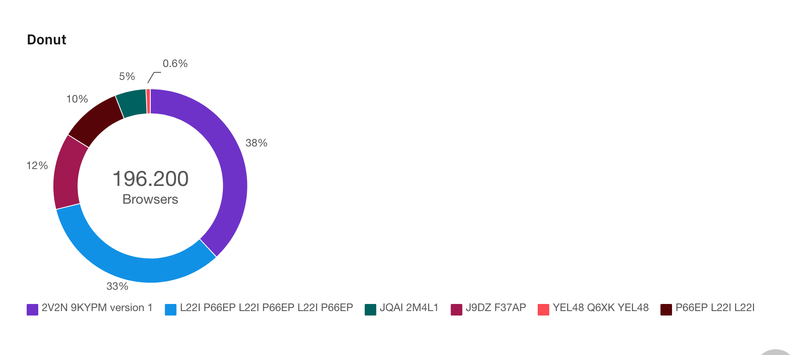

Kreis- und Ringdiagramme
========================

.. _pie:

Kreisdiagramm
-------------

.. _donut:

Ringdiagramm
------------

.. _gauge:

Halbkreisförmiges Ringdiagramm
------------------------------

Halbkreisförmige Ringdiagramme sind nützlich, um Werte zwischen einer kleinen
Anzahl von Variablen anzuzeigen, indem entweder mehrere Markierungen auf
demselben Gradmesser oder mehrere Diagramme verwendet werden.

   Die Anzeige kann beim Laden der Seite auf den aktuellen Wert animiert werden,
   um eine Hervorhebung zu erzielen.
