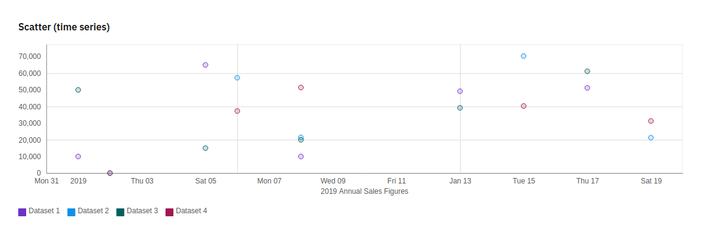
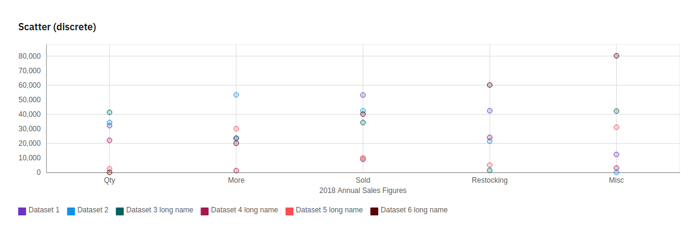
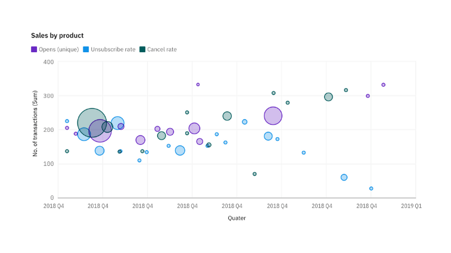

Streu- und Blasendiagramme
==========================

Streudiagramme
--------------

Streudiagramme (engl. Scatter-Plots) verwenden Datenpunkte, um zwei Kennzahlen
an einer beliebigen Stelle entlang einer Skala zu zeichnen.

Blasendiagramme
---------------

Blasendiagramme verwenden Datenpunkte und Blasen, um Kennzahlen entlang zweier
Achsen zu zeichnen. Die Größe der Blase ist das dritte Maß.

